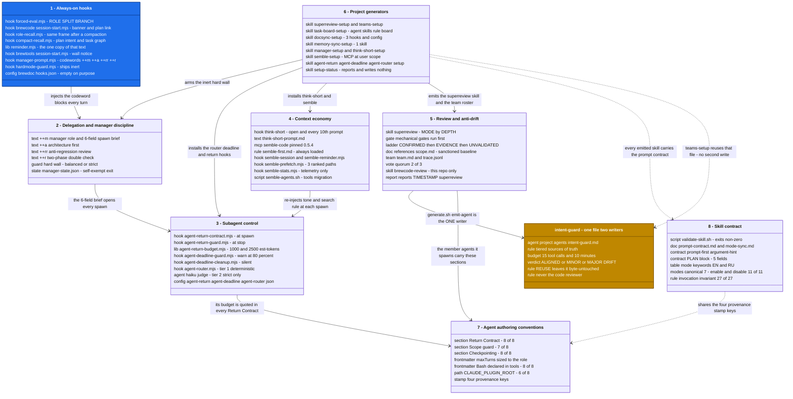
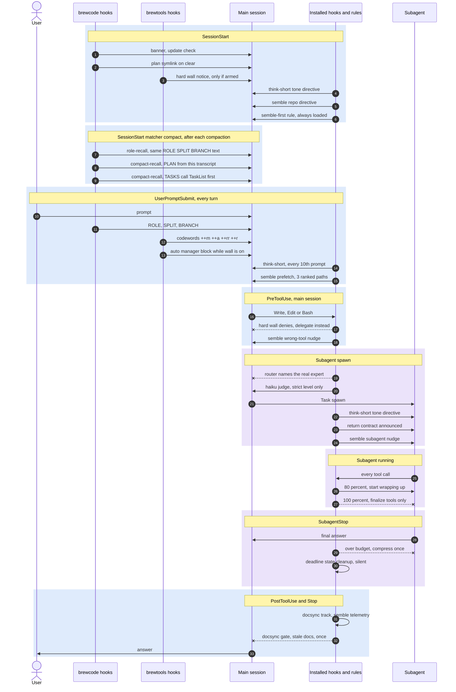

# Approaches

This page is the index of every engineering approach the brewcode plugin suite applies, and of the links
between them: which setup skill installs which hook, which skill writes which agent, which text is injected
at which moment. It is for the maintainer who forgot where a file comes from, and for the user who wants to
know what a plugin actually does to a session.

Rule: every new hook, agent, generated skill or injection gets a row here - in its domain table and in
"Where each thing lives". A feature without a row is undocumented.

## How to read this page

Column meanings are the same in every table below.

| Column | Meaning |
|---|---|
| Scope | `plugin-shipped` = live as soon as the plugin is installed. `global` = written into `~/.claude/`. `project` = written into `<repo>/.claude/`. `choice` = the skill asks you which of the two, and never guesses. |
| Trigger | The Claude Code hook event, or "context auto-load" for always-loaded text, or "user runs the skill". |
| Fires when | Plain English. The real condition, not the event name. |
| Excerpt | Real quoted text from the file. `...` marks cut middles. Never the whole prompt. |
| Project-specific | `yes` = the content differs per repository. `no` = the same bytes everywhere. |

Two more conventions used across the suite:

- **Fail-open.** Every hook returns `{}` when anything goes wrong, which means "do nothing, carry on". So a
  broken discipline layer costs you a good habit, never the ability to keep working. Only five hooks ever
  block on purpose: the hard wall, the agent router, the deadline guard, the return guard and the docsync
  gate. One hook fails open *loudly* rather than silently: `compact-recall.mjs` degrades every error path,
  including its outer `catch`, to its `[INTENT]` fragment, because after a compaction saying nothing is
  itself the failure.
- **Say it at the moment it applies.** Contracts are injected at session open, at prompt submit, at subagent
  spawn or at tool call - never left to be remembered from earlier in the context.

## Map

Two pictures. The first is the structure: the blocks this page is made of, what lives inside each, and how
they act on one another. The second is one turn in time: when each mechanism speaks, and which ones can stop
you.

**The blocks and what connects them.** One box per numbered section below; each row names the kind of
artefact and then the artefact. Blue = live the moment the plugin is installed. Amber = the one file two
generators contend over. Every other box is opt-in, or a convention that is text rather than code. A solid
arrow acts on its target; a dotted arrow means conforms to or reuses, never a second write.



**One turn in time.** A blue band is a moment in the main session, a violet band a moment inside a subagent;
the band note names the hook event. A solid arrow injects text or passes control. A crossed arrow marks a
mechanism that can deny the call or block the return - everything else fails open and stays silent. One band
is not part of the turn sequence: the compaction band fires whenever the context is squeezed, mid-turn
included, and it can fire several times in one session.



## 1. Always-on hooks

These run the moment the plugin is installed. No setup skill, no config file, no opt-in.

| Approach | File | Scope | Trigger | Fires when | Excerpt | Purpose | Problem solved | Project-specific |
|---|---|---|---|---|---|---|---|---|
| Delegation reminder on every prompt | `brewcode/hooks/forced-eval.mjs` | plugin-shipped | `UserPromptSubmit`, timeout 2 s | Every prompt, slash commands included. Skipped only for one-word replies: `yes`, `no`, `ok`, `continue`, a bare number, a single letter | `[ROLE] Manager: scan agents ... expert for this domain exists -> delegate regardless of size; ... [SPLIT] One agent for an hour = drift you cannot observe ... [BRANCH] Stay on the current branch; none chosen -> main.` - the text itself is not in this file: it is `REMINDER_TEXT` from `brewcode/hooks/lib/reminder.mjs`, shared with `role-recall.mjs` | Re-state role, subagent sizing and branch default every turn | The model does domain work itself while a project expert agent exists; one giant agent runs for an hour; a feature branch nobody asked for | no |
| Session banner, update check, plan symlink | `brewcode/hooks/session-start.mjs` | plugin-shipped | `SessionStart`, timeout 3 s | Every session start. The symlink part runs only when `source === 'clear'`, and only if the newest `.md` in `~/.claude/plans/` is under 60 s old (`PLAN_FRESHNESS_MS`, `:31`); it then points `<repo>/.claude/plans/LATEST.md` at that global file. The whole output is a `systemMessage` for the human - the model is sent nothing | `brewcode: <root> \| session: <id> \| perm: <mode>` and, when out of date, `UPDATE brewcode <installed> -> <released>: <link to the releases page>`; the link step logs `Linked: .claude/plans/LATEST.md -> <plan name>` | Show the live build and permission mode; keep the just-written plan reachable from the project | Running an old build silently; losing the plan file when Plan Mode clears the session | no |
| Role frame re-injected after a compaction | `brewcode/hooks/role-recall.mjs` | plugin-shipped | `SessionStart` with `"matcher": "compact"`, timeout 2 s | Only after a compaction, auto or `/compact`. Belt-and-braces on top of the matcher: anything but `input.source === 'compact'` returns `{}`, so `startup`, `resume`, `clear` and `fork` are silent - they still carry the frame. Unconditional otherwise, and compactions chain | The same three lines as `forced-eval.mjs`, byte-for-byte: both import `REMINDER_TEXT` from `brewcode/hooks/lib/reminder.mjs`, which exists so `[ROLE]` / `[SPLIT]` / `[BRANCH]` cannot drift between two hooks on two different events | Put the manager role back in front of the model at the one moment the summary has just collapsed every earlier copy of it | An auto-compaction has no prompt, so `forced-eval.mjs` never fires; after a few compactions the session quietly stops delegating | no |
| Plan, intent and task graph re-anchored after a compaction | `brewcode/hooks/compact-recall.mjs` | plugin-shipped | `SessionStart` with `"matcher": "compact"`, timeout 2 s | Same moment, same `source === 'compact'` guard, and it ALWAYS injects there. It scans this session's `transcript_path` only - `statSync` must report a regular file (a FIFO reports size 0 and then blocks `readFileSync` forever) of at most `MAX_TRANSCRIPT_BYTES`, `64 * 1024 * 1024`; then `Buffer.lastIndexOf` / `includes`, no JSONL parsing, ~6 ms scan (one buffer read plus five substring scans) on an 8.13 MB transcript, ~30 ms full process wall clock standalone / ~55 ms spawned from a node parent (node startup dominates). Ladder, first match wins: `plan-file` -> `plan-missing` -> `plan-in-summary` -> `intent`. `[TASKS]` is appended only when the transcript contains `"name":"TaskCreate"` | `[PLAN] Read <path> with the Read tool before doing any work. It holds the role model and the delegation split for this session ...`, or `[PLAN] The plan file for this session is gone or unreadable at <path>. Rebuild the frame from the compact summary plus TaskList, not from scratch.`, or `[PLAN] This session ran in plan mode; no plan file is available. ...`, or `[INTENT] Re-read the user ORIGINAL task and intent from the compact summary and keep executing THAT. Do not continue from the most recently remembered fragment, and do not re-scope the work.` Plus, when a graph exists: `[TASKS] Then call TaskList: a task graph created before the compact ALREADY EXISTS in this session. ... The built-in reminder lags several turns and may show empty, so TaskList is the authority. Then resume the work.` | Say what we were doing, from this session's own record, before the model decides for itself | The session loses the user's original task and starts a brand-new task graph on top of the old one | no |
| Hard-wall awareness at session open | `brewtools/hooks/session-start.mjs` | plugin-shipped, reads project state | `SessionStart`, timeout 2 s | Every session start, but speaks only when `.claude/brewtools/manager/state.json` has `hard: true` in this project | `Manager HARD wall active (project, level=...): main session is orchestration-only - delegate in bounded units ... /brewtools:manager-setup disable to exit.` | Tell the model at turn zero that its own tools are blocked, and how to leave | A whole session of denied tool calls with no explanation | yes |
| Codeword injection, plus an automatic block while the wall is on | `brewtools/hooks/manager-prompt.mjs` | plugin-shipped; text resolves project -> global -> plugin default | `UserPromptSubmit`, timeout 3 s | Every prompt. Matches `++m`, `++a`, `++rr`, `++r` as standalone tokens, so `++rr` never matches as `++r`. With no codeword it still injects the manager block when `state.hard === true` | `User typed \`++m\` - Manager mode is active for this turn:` then the block resolved from `manager-setup/references/full.md`, which opens `[ROLE: MANAGER] ... You are a Manager, not an executor. Your only actions: think, plan, build the TaskGraph, delegate, observe, integrate.` Several blocks join with `---`. The five block texts are quoted row by row in section 2 | Switch on a heavy behaviour rule for one turn by typing two characters | Standing instructions cost tokens every turn; typed by hand they drift out of use | yes, text is overridable |
| Physical main-session tool wall, shipped but not registered | `brewtools/hooks/hardmode-guard.mjs` | project, and only after install. The file ships inert: it is **not** listed in `brewtools/hooks/hooks.json` | `PreToolUse` matcher `*` | Before every tool call, but three conditions must all hold. (1) `/brewtools:manager-setup install` has copied the file into the project and registered it in `.claude/settings.local.json` - the shipped copy is never registered. (2) The project `state.json` has `hard: true`; anything else and the guard returns `{}`. (3) The stdin payload carries `agent_id` (`hardmode-guard.mjs:295-298`) - that key is present only inside a real subagent, which always passes through. `agent_type` alone is not enough: a main session started with `claude --agent <name>` carries it too, so it stays walled. Neither key present also means walled | `Hard wall: Write is blocked in the main session - delegate to a subagent. ... To exit run \`/brewtools:manager-setup disable\`` | Make the manager role a machine rule, not advice | The model reads "delegate everything" and edits a file anyway | yes |
| No hooks at all | `brewdoc/hooks/hooks.json` | plugin-shipped | none | Never. The file is `{"hooks":{}}` | - | brewdoc is a pure skill plugin, zero runtime cost | A hook process on every prompt for a plugin with nothing to inject | no |
| No hooks and no `hooks.json` | `brewui/` | plugin-shipped | none | Never. There is no `brewui/hooks/` directory at all, and `brewui/skills/` holds only `.gitkeep` | - | A registered placeholder plugin that costs a session nothing | Assuming from the three tables above that every plugin in the suite has a hook layer | no |
| One shared stdin/stdout/logging helper per plugin | `brewcode/hooks/lib/utils.mjs` (227 lines), `brewtools/hooks/lib/utils.mjs` and `brewdoc/hooks/lib/utils.mjs` (91 lines each) | plugin-shipped | none | Never on its own. Imported by the entry hooks for `readStdin`, `output`, `capText`, `log`, `loadConfig`, `getState`, `saveState`. `capText` and `TEXT_CHANNEL_CAP` live here rather than in one hook for the same reason `lib/reminder.mjs` exists: three brewcode hooks cap the same way and a copy would drift. The three copies are not identical, and brewdoc's is an orphan - brewdoc registers no hooks, so nothing imports it | `export async function readStdin()` ... `export function output(response)` | One place per plugin for the fail-open stdin/stdout shape every hook repeats | Each hook re-implementing stdin parsing and the empty-`{}` reply, each with its own bug | no |

Notes for this section:

- All four text-injecting hooks in this section use `hookSpecificOutput.additionalContext`, never
  `updatedInput`, which is silently dropped on `UserPromptSubmit` in CC 2.1.x: the two on that event
  (`forced-eval.mjs`, `manager-prompt.mjs`) and the two on `SessionStart` matcher `compact`
  (`role-recall.mjs`, `compact-recall.mjs`). All four cap injected text at 9000 chars, below a 10K
  disk-spill threshold noted for CC 2.1.174 - the three brewcode ones through the shared
  `capText` / `TEXT_CHANNEL_CAP` in `brewcode/hooks/lib/utils.mjs:40`, `:48`, brewtools' through its own
  local `capText(s, max = 9000)` (`manager-prompt.mjs:34`).
- Channel semantics, verified against the CC 2.1.232 bundle: `updatedInput` (`PreToolUse`) and
  `updatedToolOutput` (`PostToolUse`) are single-writer/last-wins - every hook on the event receives the
  same original value and the runner keeps only the last hook's edit, so two hooks writing either one
  clobber each other; both are schema-validated, and a malformed value denies the tool call rather than
  being ignored. `additionalContext` accumulates across every hook registered on the same event - no
  clobbering, any number of hooks compose. `PreToolUse` `additionalContext` reaches only the parent
  session, never a subagent; `SubagentStart` `additionalContext` reaches the subagent and supports an
  `agent_type` matcher. This is why think-short's subagent injection (below) moved off `updatedInput`.
- brewcode registers three hooks on `SessionStart`, and they split cleanly. `session-start.mjs` runs on every
  start and sends the model nothing - its whole output is a `systemMessage` for the human. The other two,
  `role-recall.mjs` and `compact-recall.mjs`, sit in a `"matcher": "compact"` group, run only after a
  compaction, and speak *only* to the model through `additionalContext`, with no `systemMessage` at all.
  So "brewcode's SessionStart is human-only" holds for the unmatched hook and is false for the compact pair.
- Installing brewtools does **not** arm the wall. Only `/brewtools:manager-setup install` does.
- Nothing in the suite registers `SessionEnd`, `PreCompact` or `PostCompact`. Zero hits across all three
  `hooks.json`, every generated `assets/INSTALL.md` and this repo's own `.claude/settings.json`. It still has
  nothing to say once a session is over. Compaction is a different case: the suite does speak there, but it
  speaks *after* the squeeze, on `SessionStart` matcher `compact`, because that is the only channel that
  reaches the model - `PostCompact` output lands in the UI as `userDisplayMessage`, which the model never
  sees (`compact-recall.mjs:6-7`), and anything injected before a compaction is exactly what the compaction
  then collapses.

## 2. Delegation and manager discipline

The forced-eval `[ROLE]` / `[SPLIT]` / `[BRANCH]` lines from section 1 are the base layer: they are always on.
Everything below is optional and sits on top of that base. Codewords ship with the plugin and always work; the
wall has to be installed first.

| Approach | Installed by | Scope | Trigger | Fires when | Excerpt | Purpose | Problem solved | Project-specific |
|---|---|---|---|---|---|---|---|---|
| `++m` manager role | text in `brewtools/skills/manager-setup/references/full.md`; `manager-setup` only re-texts it | plugin-shipped | `UserPromptSubmit` | You type `++m` and the session is not in plan mode. One turn only | `You are a Manager, not an executor. Your only actions: think, plan, build the TaskGraph, delegate, observe, integrate. ... "Faster to do it myself" is a symptom, not an argument - delegate anyway.` | Put the session in orchestrator mode for one turn | The model works instead of fanning out | no |
| 6-field spawn brief, part of the `++m` block | same file, `references/full.md` | plugin-shipped | `UserPromptSubmit` | Same turn as `++m` | `GOAL ... ROLE - what this agent owns; what it must NOT touch. SCOPE - exact paths ... CONTEXT ... CONSUMER ... DONE - acceptance criteria + the exact report shape. A bare one-line task is never enough.` | Every subagent brief carries six named fields | The agent invents its own scope and returns an unusable report shape | no |
| `++m` in plan mode | `references/planmode.md`, appended to the `full.md` block | plugin-shipped | `UserPromptSubmit` with `permission_mode === 'plan'` | You type `++m` in plan mode. Adds a plan addon to the full block | `This instruction dies when you exit plan mode - the PLAN does not. So the role must live INSIDE the plan ... STEP 0 ... "Re-assume MANAGER role. Create the ENTIRE TaskGraph now"` | Carry the manager role across the plan-mode boundary | The role evaporates on exit and implementation starts hand-coding | no |
| `++a` architecture first | `references/architect.md` | plugin-shipped | `UserPromptSubmit` | You type `++a`; combines with the other groups | `Before implementation, delegate an architecture pass ... do not design it inline. ... As SIMPLE as possible while staying scalable ... Find the closest well-built existing counterpart in the repo ... ADDITIVE to conventions/rules/docs, never instead.` | Design becomes a delegated, written step | Improvised inline design that ignores existing patterns | no |
| `++rr` anti-regression review | `references/review-regression.md` | plugin-shipped | `UserPromptSubmit` | You type `++rr`. It beats `++r` | `ONE primary focus, three axes: 1. NO REGRESSION (primary) ... Review is two-phase, always ... b. Double-check - re-verify each finding before acting (no blind fixes).` | Regression-first, two-phase review after each phase | New code breaking what worked; reviewers fixing findings that were never real | no |
| `++r` two-phase double check | `references/review-double.md` | plugin-shipped | `UserPromptSubmit` | You type `++r` and not `++rr` | `Before the review proper, pass the code for simplification ... 1. Review. 2. Double-check ... 3. Fix - only after confirmation. Never fix on first pass without the double-check step.` | Simplify, review, verify, then fix | Fixing hallucinated findings; shipping over-engineered code | no |
| Hard wall, `level balanced` (default) | `/brewtools:manager-setup install` | project only, there is no global wall | `PreToolUse` matcher `*` | Every main-session tool call while `state.hard === true` | `Hard wall (balanced): only read-only Bash is allowed in the main session - delegate execution to a subagent.` and, for the flat denials, `Hard wall: ${tool} is blocked in the main session - delegate to a subagent.` (`hardmode-guard.mjs:328`, `:312`) | Remove the session's hands, keep inspection. The allowlist is closed: it permits `Read/Grep/Glob`, `Task/Agent/Skill`, plan tools, task tracking, `AskUserQuestion`, read-only Bash and read-verb MCP, and denies everything else - `Write`, `Edit`, `NotebookEdit`, `WebFetch`, `Artifact`, mutating MCP and any tool not on the list (`hardmode-guard.mjs:80-102`, `:321-342`) | "Faster if I just do it": the session implements everything itself with no observable trail | yes |
| Hard wall, `level strict` | `/brewtools:manager-setup level strict` | project | `PreToolUse` matcher `*` | Same, and additionally denies all Bash, WebSearch and every MCP tool | `Hard wall (strict): Bash is blocked in the main session - delegate execution to a subagent.` | Zero main-session execution | A "read-only" chain that quietly mutates via redirects, `git add`, `sed -i` | yes |
| Self-exempt off-switch | same install | project | `PreToolUse` matcher `*` | One exact command shape passes at every level. No `&&`, no `$`, no env prefix, no `-e` | `node <ABS>/.claude/brewtools/manager/manager-state.mjs set hard=false` | You can always leave the wall | Being locked in with no exit; also an arbitrary-code-execution hole an earlier substring anchor allowed | yes |
| Automatic manager injection while the wall is on | side effect of `state.hard === true` | project | `UserPromptSubmit` | Every turn while the wall is up, with no codeword typed | `Manager HARD wall is ON - operate as orchestrator (delegate everything):` plus the whole `++m` block | Keep the role text present while the wall is up | The wall denies tools while the model has no idea why | yes |
| One state reader behind all three wall mechanisms | ships with brewtools as `brewtools/hooks/lib/manager-state.mjs` | project state, with a global twin for `mode` only | none of its own - imported | Whenever `session-start.mjs`, `manager-prompt.mjs` or the installed `hardmode-guard.mjs` needs the state. All three import `resolveState`, so the notice, the auto-injection and the denial can never disagree about whether the wall is up | `SECURITY: hard and level come ONLY from the PROJECT state.json - a global state.json must never enable the HARD wall in projects without their own state` (`manager-state.mjs:127-129`) | One resolver, one answer, and a wall that cannot be armed from `~/.claude` | Three hooks each re-reading the file with their own defaults; a global setting silently arming every repo you open | yes |
| Codeword text resolved project -> global -> plugin | `brewtools/hooks/lib/manager-prompts.mjs` | plugin default, overridable at `project` or `global` | none of its own - imported by `manager-prompt.mjs` | On every codeword hit. `<repo>/.claude/brewtools/manager/prompts/<mode>.md`, then `~/.claude/manager/prompts/<mode>.md`, then `<pluginRoot>/skills/manager-setup/references/<mode>.md`. Only the text inside fenced blocks is injected; a file with no fence is used whole | `Injected text = inside fenced ... blocks if present (concatenated in order), else the whole file (raw-text fallback)` | Retext a codeword for one repo, or for every repo, without touching the plugin | An edited plugin file lost on the next update; and there is no global *wall*, but there is a global *text* override | yes when overridden |

## 3. Subagent control

Three opt-in setups. None is registered in `brewtools/hooks/hooks.json` - installing the plugin does nothing
until you run the skill, which delegates the file work to `brewcode:hook-creator` following an
`assets/INSTALL.md` runbook. They work together, each at its own moment: the router at spawn, the return
contract at `SubagentStart`, the deadline all the way through, and the return guard plus the deadline cleanup
at `SubagentStop`. Sharing the `SubagentStop` event is safe, because the cleanup hook always returns `{}` and
never asks for a decision.

| Approach | Installed by | Scope | Files | Trigger | Fires when | Excerpt | Config and defaults | Off switch | Purpose | Problem solved |
|---|---|---|---|---|---|---|---|---|---|---|
| Return contract announced at spawn | `/brewtools:agent-return-setup` | choice: project, global or both | `hooks/agent-return-contract.mjs` + shared `hooks/agent-return-budget.mjs` | `SubagentStart`, timeout 5 s | The moment any subagent is spawned, before it does anything. Same text for every agent type | `RETURN CONTRACT ... Verdict first, <=30 lines, \`path:line\`. !=bodies/output/log/preamble. Over ~1000 tokens your return is blocked for compression; over ~2500 write the detail to ... and return that path + verdict + <=3 lines.` | `.claude/agent-return.json`, project wins over global, found by walking up at most 16 directories. Each threshold resolves in this order: config key, then env var (`AGENT_RETURN_PASS` / `AGENT_RETURN_FILE`), then the built-in `passTokens` 1000 / `fileTokens` 2500 (`agent-return-budget.mjs:113`, `:115`). The announced numbers are the resolved ones, so what is announced is what is enforced | Live config flag: `enabled === true` only; absent key or file = OFF | Put the return rule in front of the agent at the moment it applies | A prose rule in the preamble loses to whatever the agent just did |
| Return size budget enforced at return | same skill; all 3 files install as one unit | same | `hooks/agent-return-guard.mjs` | `SubagentStop`, timeout 5 s | When a subagent produces its final answer, just before it reaches the manager session | `RETURN TOO LARGE (~N tokens, budget 1000). ... Re-send the SAME answer, compressed: keep the verdict line and every \`path:line\` ref, drop preamble, file bodies, command output, logs` | `t = ceil(len/4)`. `<=1000` pass, `1000..2500` block for compression, `>2500` block and order a report file. No LLM judge, two integer comparisons | Same flag; blocks at most once via `stop_hook_active` | Cap the single biggest context cost in a manager session | Ten subagents each dump their full output into the main session, context fills and compacts. Measured over 80 real returns: p50 1404 est-tokens, max 7931, 58% of the total is overflow above 800 |
| Soft wall-clock deadline | `/brewtools:agent-deadline-setup` | choice: project, global or both. Global costs ~58 ms per tool call everywhere | `hooks/agent-deadline-guard.mjs` | `PreToolUse` matcher `.*`, timeout 5 s | Every tool call, but acts only when the payload carries both `agent_id` and a non-empty `agent_type`. The clock starts at the agent's first tool call | 80%: `N of your 20 minute time budget are used. Start wrapping up NOW`. 100%: `AGENT DEADLINE EXCEEDED ... The tool "X" is blocked and retrying it will fail again. Stop investigating` | `.claude/agent-deadline.json`: `defaultMinutes` 20, `byAgentType` `{}`, `hardStopRatio` 2. Not configurable: warn at 0.8 of the budget, repeat a notice at most once per 10% of the budget, prune state older than 24 h. Past 100% only the 7 advertised finalize tools plus `TaskCreate`, `BashOutput`, `TaskOutput` are allowed; `AskUserQuestion` is denied on purpose. Past `hardStopRatio` (2x the budget) the list shrinks to `Write` and `Edit` only | Live config flag: `enabled !== true` = OFF | Force a runaway agent to finalize instead of killing it | An agent runs an hour, unobservable and drifting. `maxTurns` would kill it and throw away the report. Time is sampled only at tool-call boundaries, so one 25-min `Bash` call is invisible |
| Deadline state cleanup | same skill, installed together | same | `hooks/agent-deadline-cleanup.mjs` | `SubagentStop`, timeout 3 s | When a subagent finishes for any reason | No text. Deletes `<tmpdir>/brewtools-agent-deadline/<session>/<agent>.json`, prunes dirs older than ~24 h, always returns `{}` | State only: `{ start, warned, expired }`, mode 0700, never under `~/.claude` | None - unconditional bookkeeping, harmless when the guard is off | Keep the tmp state tree self-cleaning | A stale `start` carries a used-up budget into a new agent id |
| Route a generic spawn to the real expert, tier 1 | `/brewtools:agent-router-setup` | **project only** - the roster is per project, no scope question | `.claude/hooks/agent-router.mjs` | `PreToolUse` matcher `Agent`, timeout 5 s | Every main-loop agent spawn; an omitted `subagent_type` is normalized to `general-purpose` before the project-agent and generic checks run, so it is policed too, per the Agent tool contract. Exits instantly if `agent_id` is present, if the picked type is a project agent, is in `neverFlag`, or is not in `genericTypes` | `agent-router: this looks like skill authoring - 'brewcode:skill-creator' is the expert for it, not general-purpose - retry with subagent_type: brewcode:skill-creator. (Deliberate? retry once and it passes.)` | `.claude/brewtools/agent-router.json`: `level` fast, `genericTypes` `["general-purpose","worker"]`, `neverFlag` 8 entries, `minScore` 3, `margin` 2, 4 built-in intents. Anti-loop: one deny per session+root+task. `status` staleness is `content_version`-based: it compares the installed hook's header against the plugin template, and the config's `content_version` against `assets/INSTALL.md`'s header - `version`/`plugin` fields are informational provenance only, never deciding staleness | Live flag, **inverted**: only `enabled === false` disables. Missing file = ON with defaults and still **effective**; `stale=yes` stays effective too, just running old logic. Re-install is idempotent but not inert: it re-copies `agent-router.mjs`, which is what repairs a stale hook body | Stop the main loop reaching for `general-purpose` when a hand-written expert exists | The repo ships a domain expert and the manager spawns `general-purpose` out of habit. The deny reaches the model as a tool error, so a retry always passes |
| LLM judge for ambiguous spawns, tier 2 | `/brewtools:agent-router-setup level strict` | project only; the judge prompt is inlined into `settings.json`, never copied | a second `.claude/settings.json` entry | `PreToolUse` matcher `Agent`, timeout 30 s | Every `Agent` spawn once installed. Hooks run in parallel, so tier 1 cannot gate it | `Bias to {"ok": true} on ANY doubt. A wrong redirect costs the user a full wasted agent run against an ill-fitting expert; a missed redirect costs nothing` | Wired as `type: "agent"`, model `claude-haiku-4-5-20251001`, `timeout: 30` - Claude Code hook timeouts are in seconds, so that is 30 s, not 30 ms (`agent-router-setup/assets/INSTALL.md:264`, `:296`, `:386`). `level` in the config is only a record of what was wired; editing it by hand changes nothing | Re-run at `level fast`. Setting `enabled:false` does NOT stop tier 2 costing a model call | Catch domain fits too indirect for a regex | Tier 1 matches trigger words, not meaning |

Known limits: tier 2 is wired but never verified end to end; the return guard blocks at most once, so a
compressed second answer can land slightly over budget (observed 1417 -> 1026 against 1000); the deadline
samples time only at tool-call boundaries.

## 4. Context economy

What keeps the main context small. The return budget (section 3) saves the most on its own, so it is not
repeated here.

| Approach | Installed by | Scope | Trigger | Fires when | Excerpt | Off switch | Purpose | Problem solved | Project-specific |
|---|---|---|---|---|---|---|---|---|---|
| think-short at session open | `/brewtools:think-short-setup install` | choice: project or global, one target per run | `SessionStart` | Every session start or resume; also resets the per-session counter and prunes markers older than ~1 day | `Be terse. Results first, no preamble/filler/sycophancy. ASCII only. ... Grep before Read. Edit over Write. Parallel calls in one message.` ... `Keep code simple - do not over-engineer. ... find the closest well-built counterpart in the repo` | `disable` renames `think-short-prompt.md` to `.disabled`; hooks stay wired and no-op | Set output style and coding taste for the whole session | Verbose, sycophantic, over-commented output; serial tool calls | no |
| think-short reminder every 10th prompt | same | same | `UserPromptSubmit` | Prompts 10, 20, 30 ... of a session. `const INTERVAL = 10`, never the first | The same text, re-injected verbatim | same rename switch | Re-anchor terseness after the opening directive is buried | Terseness decays as the session grows | no |
| think-short into every subagent | same | same | `SubagentStart` | Every subagent spawn. Delivers the directive as `hookSpecificOutput.additionalContext` | The same body, unmodified | same rename switch; `additionalContext` accumulates across hooks, so no coexistence/yield logic is needed | Give subagents the same output contract | A subagent inherits no parent context and returns a wall of prose | no |
| Pinned semantic-search MCP | `/brewcode:semble-setup install` | MCP at **user** scope (`semble[mcp]==0.5.4`, `alwaysLoad: true`); everything else project | user runs the skill | The MCP is registered once, into `~/.claude.json`, and is then available in every project on the machine - but only from a NEW session. A fresh registration is invisible to the session that made it, so install stops at a reload checkpoint and finishes via `resume` | Exposes `mcp__semble_code__search` and `mcp__semble_code__find_related` | `disable` sets `state.enabled=false`; nothing is deleted, all hooks read the flag | Make semantic search available before a grep habit forms | Grep fails on behaviour and intent questions where the wording is absent from the code | yes for project state; the MCP is machine-wide |
| semble-first rule and CLAUDE.md block | same | project | context auto-load | Every request, as part of the always-loaded instructions. Two files: the full table lives in `.claude/rules/semble-first.md`, and a 6-line summary is written into `<repo>/CLAUDE.md` between the literal markers `<!-- BEGIN brewcode:semble -->` and `<!-- END brewcode:semble -->`. Re-install replaces the marked range in place and never appends a second block; a BEGIN without its END reports `malformed marker block` and changes nothing | `Semantic search first: ONE mcp__semble_code__search with repo = absolute project root, top_k=5, max_snippet_lines=10 - then open the hit at start_line. rg/Grep stays for exact identifiers, regexes, paths and exhaustive enumeration.` plus `top-k is a ranked sample, not a list: "every/all" is unanswerable in principle.` | `uninstall`/`purge` remove the text; `disable` leaves it and only silences the hooks | Teach the tool split once, in the always-loaded layer | The same question searched twice - semble then an equivalent `rg` - and semble used for enumeration it cannot do | yes, text is generic |
| semble session directive | same | project | `SessionStart`, timeout 5 s | Session start, only when `.claude/semble/state.json` phase is `ready` or `awaiting_reload` | `semble: use ONE mcp__semble_code__search first (repo=<cwd>, top_k=5, max_snippet_lines=10), then open the hit at start_line.` | `enabled` flag | Restate the contract with the real repo path filled in | The model calls the MCP without `repo`, which is required and never inferred | yes |
| semble wrong-tool nudge - `semble-reminder.mjs` | same | project | `PreToolUse` matcher `Bash\|Grep` | Just before a shell or grep search that looks like a behaviour question. Suppressed for identifiers, short patterns, regex metacharacters, paths, enumeration words (`every`, `all`, `how many`, `list the`), `find` and pipes. Only calls that pass that gate advance a counter in `.claude/semble/reminder.json`; it injects when `count % reminderEvery === 0`, and `state.reminderEvery` defaults to 1, so by default the gate is the only volume control. A corrupt or absent counter resets to 0 | `semble: wrong tool. mcp__semble_code__search repo="<cwd>" first. (first call builds the index; exact/-l stays rg)` | `enabled` flag | Catch the habit at the moment it fires | Reaching for grep on a question grep cannot answer | yes |
| semble subagent nudge | same | project | `SubagentStart`, unmatched | Every subagent spawn, no throttle | `semble: mcp__semble_code__search is already available to you - no ToolSearch needed. ... Use rg only for exact identifiers, literal strings and exhaustive enumeration.` | `enabled` flag | Tell a context-less subagent the tool exists and is not deferred behind ToolSearch | A subagent greps the repo because it never saw the rule | yes |
| semble prefetch - result, not advice | same | project | `UserPromptSubmit` | A typed prompt of 30 to 2000 chars (`semble-prefetch.mjs:213`, `:214`) with question intent and a domain or repo reference. `THROTTLE_MS` 30 s (`:116`), `SEARCH_TIMEOUT_MS` 3 s (`:133`), `TOP_K` 3 (`:134`), `COOLDOWN_MS` 10 min after a failure (`:122`) and `TIMEOUT_COOLDOWN_MS` 1 min after a timeout (`:131`). Silent on a cold index | `These candidate locations were ranked for the question above before you started:` then top 3 `path:line`, then `Open the candidates that look right BEFORE running any search of your own` | `enabled` flag, fail-open on every error path | Run the search for the model and hand over ranked paths | The model burns turns rediscovering locations a 3-second index lookup already knows | yes |
| semble agent migration | same, `semble-agents.sh apply` | project `.claude/agents/**/*.md` | one-off at install, upgrade or resume | An agent declares a `tools:` allowlist that lacks the two MCP tool names | Appends `mcp__semble_code__search, mcp__semble_code__find_related` to `tools:` in whatever list form it uses | `--revert`; wildcards and `disallowedTools` conflicts are skipped | Make sure every project agent can call the tool the rule names | A rule ordering semble-first inside an agent with no permission to call it | yes |
| semble telemetry - `semble-stats.mjs` | same | project | `PostToolUse` and `PostToolUseFailure`, both with matcher `mcp__semble_code__search\|mcp__semble_code__find_related\|Bash\|Grep\|Glob\|Read` | After every matching tool call, whether it succeeded or failed. One file registered twice, which is why 5 semble hook files produce 6 settings entries. It is the only hook in the whole suite on `PostToolUseFailure` - a search that errored is still a data point about which tool was reached for | None - pure observer, always `{}`. Log at `.claude/semble/telemetry.jsonl`, trimmed at 2 MB | `enabled` flag | Measure whether semble calls actually displaced grep-shaped calls | Adoption claims with no numbers behind them | yes |
| Session learnings compacted into the rule layer | `/brewcode:rules` | project `.claude/rules/` only, **never** `~/.claude/rules/` | user runs the skill | You run it after a session that produced a lesson worth keeping. It syncs `KNOWLEDGE.jsonl` or the session's learnings into `avoid.md`, `best-practice.md` and `{prefix}-avoid.md` / `{prefix}-best-practice.md` for one slice of the repo | `Claude Code auto-loads .claude/rules/*.md into every session, so entries must be table rows, not prose` (`rules/SKILL.md:189`) | not a `-setup` skill: delete or trim the rule file | Grow the always-loaded layer in the cheapest shape there is | A lesson learned twice; a rule file that turns into an essay and costs every request | yes |
| Etalon and convention extraction | `/brewcode:convention` | project | user runs the skill | You run it on a repo whose patterns are not written down. Default mode `full`; mode `rules` writes only into `.claude/rules/` | `argument-hint: "[prompt] [full\|conventions\|rules\|paths <p1,p2>]"` | same - delete what it wrote | Name the repo's real etalon classes and patterns once, in the layer every session already reads | Every agent re-deriving the house style from scratch, and each one deriving it differently | yes |

The order these arrive in a session: think-short comes first, at session open, and sets the tone of the
output. semble-first comes next and decides how the session looks things up. The manager text comes last,
once per turn, and turns the session from a worker into a coordinator.

## 5. Review and anti-drift

| Approach | Installed by | Scope | Files | When it runs | Excerpt | Purpose | Problem solved | Project-tailored |
|---|---|---|---|---|---|---|---|---|
| Two-axis review: MODE x DEPTH | `/brewcode:superreview-setup` | project only, no global option | `.claude/skills/superreview/SKILL.md` | Every run of the emitted `/superreview` | `{MODE} selects SCOPE (FULL_PROJECT / EXPLICIT / UNCOMMITTED / LAST_COMMITS). {DEPTH} selects EFFORT ... inferred SEMANTICALLY from the user's prompt ... no --fast, no flag` | Scope and effort decided before any agent is spawned | A full fan-out burned on a two-line diff; a flag nobody remembers to type | mechanism fixed, gates tailored |
| `QUICK` depth, the default | same | project | same `SKILL.md` | Default of every run unless the prompt asks for depth | `QUICK (the DEFAULT and common case - mechanical gates + the intent pass, ONE spawn, no domain experts)` | Cheap review that still answers "did I build what was asked" | A review so expensive nobody runs it | fixed shape |
| `EXTENDED` depth, full fan-out | same | project | `SKILL.md` + `references/scope.md`, `references/agent-prompt.md` | Only when the prompt asks for depth or expertise, in any language | `ONE parallel message ... intent-guard + domain experts + scope pass A ... + scope pass B ...; shared JSON finding contract` | Route each changed-file group to the agent that owns that domain | "a review routed to generic agents finds generic issues" | expert roster resolved at runtime from live `.claude/agents/*.md` |
| Mechanical gates as ground truth | same | project | `SKILL.md` step 1 | First step of both depths | `Run the MECHANICAL GATES (build/lint/test) - execution output is CONFIRMED-BY-EXECUTION, the ONE verdict needing no adversarial pass` | Run the build before arguing about the code | Models discussing the quality of code that does not compile | gate commands discovered per project |
| Adversarial per-finding validation | same | project | `SKILL.md` Phase 3 | `EXTENDED` only, after the fan-out | `spawn ONE validator that independently RE-VERIFIES EVERY candidate finding in reverse ... Per-finding gate, NOT a sample` plus `an agent may not validate findings from the group IT reviewed in Phase 2` | Every claim re-checked by someone who did not make it | A reviewer agreeing with itself; false positives shipped as findings | validator and arbiter are project agents |
| Verdict ladder | same | project | `SKILL.md` verdict rules | Both depths | `mechanical gate output carries CONFIRMED-BY-EXECUTION ... an intent-guard row carries CONFIRMED-BY-EVIDENCE ... A finding that could not be validated carries verdict: UNVALIDATED - claiming nothing` | Three named sources of truth; anything else is marked unproven | Confident-sounding findings with no evidence; an incomplete run passing as complete | fixed |
| Scope discipline against a sanctioned baseline | same | project | `references/scope.md` | `EXTENDED` only | `Resolve the SANCTIONED SCOPE baseline (task + issue + recorded decisions); audit scope creep / blast radius / under-delivery - an unsanctioned touch is a first-class finding` | Measure the diff against what was sanctioned | Quiet scope creep and quiet under-delivery both passing review | wired to the real tracker; no baseline -> `UNKNOWN` and a permanent P2 cap |
| `intent-guard` anti-drift agent | written by `/brewcode:superreview-setup` `generate.sh emit-agent`; `/brewcode:teams-setup` calls the same writer | project | `.claude/agents/intent-guard.md` | Both superreview depths, unconditionally. At `QUICK` it IS the review. In a team: by explicit name only, never during development | `Drift starts small at the first turn and is large by the last one. A model can follow an approved plan faithfully for hours and still deliver something the requester did not ask for.` | One read-only pass: was the DELIVERED thing the ASKED thing | The implementation quietly stops serving the goal you asked for | frontmatter fixed; invariants, drift examples and evidence commands tailored |
| Tiered sources of truth for intent | same | project | `intent-guard.md` sec. 1 | Every intent pass | `Highest tier wins EVERY contradiction ... Tier 1 may not exist. The user often just typed the task in chat. That is NORMAL ... treat the verbatim request as tier 1 ... Never invent a source` | Rank ticket > spec > plan > policy > transcript | A stale plan file outranking what the user said five minutes ago | tier locations are project scalars, `none` allowed |
| Cheap-evidence budget | same | project | `intent-guard.md` sec. 2 | Every intent pass | `Hard budget: <= 15 tool calls, <= 10 minutes. You are a smell test, not an audit.` plus `A claim you cannot back with a name, a path, a count or a one-line peek is not a finding - drop it.` | Keep the drift pass cheap enough to run every time | An anti-drift check that costs as much as the review and gets switched off | evidence commands tailored to the stack |
| One writer, reuse wins | same | project | `.claude/agents/intent-guard.md` | Every emit, and whenever teams-setup builds a team | `a USABLE file already exists -> the writer prints INTENT_GUARD: REUSE <path> and leaves it BYTE-UNTOUCHED ... Do not "refresh" it, do not diff-merge it` | Two generators, one file, no overwrite of tuning | A second skill silently rewriting a hand-tuned agent | reuse, migrate or create per project state |
| Dynamic teams of domain agents | `/brewcode:teams-setup` | project | `.claude/teams/{TEAM}/team.md`, `trace.jsonl`, one `.claude/agents/{name}.md` per member | On install or upgrade; members then work as normal project agents | `For each agent, spawn Task(subagent_type="brewcode:agent-creator") - ONE agent file per spawn, never "create the whole team" in one task` | A roster of narrow domain owners instead of one generalist | Overlapping vague agents that all answer the same way | roster and models derived from project analysis; size chosen by the user |
| Append-only team trace with a read cursor | `/brewcode:teams-setup` | project | `.claude/teams/{TEAM}/trace.jsonl`, `trace.cursor`, `trace-archive.jsonl`, all through `scripts/trace-ops.sh` | A member appends one line per event with `trace-ops.sh add`; only three kinds are accepted, each with its own closed vocabulary - `track` (`took\|refused\|completed\|failed`), `issue` (`low\|medium\|high\|critical`), `insight` (`pattern\|architecture\|performance\|security\|convention\|debt`). `status` reads back everything after the cursor and then sets the cursor to now; `cleanup` moves old lines into `trace-archive.jsonl` and resets the cursor | one line is `{"ts":...,"sid":...,"src":...,"k":"track","s":"completed","txt":...}`; `If cursor exists and <10 post-cursor entries: expand to last 30 days` | A cheap shared ledger the whole team writes to and the status pass reads once | Team history living in chat scrollback; a status pass re-reading the same entries every run | roster is per project; the record shape is fixed |
| Quorum consensus on generated agents | `/brewcode:teams-setup` | project | gates writes into `.claude/agents/*.md` | Phases C5-C7, right after the roster is written | `Quorum threshold: 2/3 agreement = confirmed. Match criteria: same file + same area (+/- 5 lines or same section) + same category` | Three independent reviewers, only agreed findings get fixed, then a fourth verifies | One reviewer's opinion or hallucination rewriting the roster | thresholds fixed; reviewers are the project's own agents |
| Reviewer-role exclusions | `/brewcode:teams-setup` | project | - | C5/C7/C9 and C8/U4 | `intent-guard is never the REVIEWER. It is not a general reviewer: it only compares asked-vs-delivered on a real delivery, and it has no code domain.` | Keep the drift checker out of code review and implementation | One agent doing the work and its own oversight | fixed |
| Report artefact convention | `/brewcode:superreview-setup` | project | `.claude/reports/{TIMESTAMP}_superreview/REPORT.md` | End of every run | `ONE consolidated, validated, P0->P3-sorted report` - the skill recommends fixes, never edits | One timestamped ranked artefact per run | Findings scattered across chat scrollback | fixed path shape |
| Emitted-skill self-correction | `/brewcode:superreview-setup` | project | edits `.claude/skills/superreview/SKILL.md` and `references/scope.md` in place | Phase 4b, `EXTENDED` only, after the report | `corrects the emitted SKILL.md + references/scope.md IN PLACE ... a gate that reported not run because the command does not exist ... Line delta <= 0, facts only` | The review skill fixes its own stale facts | A generated skill routing to agents that no longer exist | yes by definition |
| Workspace-local review skill | none - hand-maintained, not shipped | this repo only: `.claude/skills/brewcode-review/` | `SKILL.md`, `references/agent-prompt.md`, `references/report-template.md` | User types `/brewcode-review`; default `-q 3-2` | `if unique_agents >= M: # Quorum threshold`, then `Single reviewer (Opus) verifies ALL confirmed findings`, optional critic `Find what ALL reviewers MISSED.` | Quorum, then double-check, then an optional devil's advocate | Single-reviewer bias; unverified findings; blind spots | fully adapted to this repo, hand-written |

The anti-drift chain, in order. First, the 6-field spawn brief (section 2) writes the goal down before any
subagent starts. Then `intent-guard` compares what was asked against what was delivered and reports
`ALIGNED` / `MINOR DRIFT` / `MAJOR DRIFT`, quoting the exact words it judged against. Finally a second
opinion - either a vote or a separate validator - keeps that check itself from being wrong. Ownership:
`teams-setup` owns who is on the team, `superreview-setup` owns the `intent-guard.md` file.

The three second-opinion styles are not the same thing. Teams uses a fixed 2 out of 3 vote by 3 reviewers.
brewcode-review uses a vote you configure yourself (N agents, M of them must agree). superreview uses no vote
at all: one validator re-checks each finding, and it may never validate findings from the group it reviewed
itself. `intent-guard` rows skip that validator on purpose - they already carry their own evidence.

## 6. Project generators

A generator skill does not do the work. It reads the target repo, writes project-local skills, agents, rules,
hooks and state, and is then idle. You run what it produced.

| Generator | Scope | Generates | Kind | Project-tailored | Off switch |
|---|---|---|---|---|---|
| `/brewtools:task-board-setup` | project; a path-like first token retargets it, else cwd | `.claude/agents/task-tracker.md`; `.claude/skills/task-board/SKILL.md`; `.claude/rules/tasks.md`; `.claude/features/{board,PROGRESS,TRACKER,TASK_TEMPLATE,INDEX}.md` + 5 subdirs; SPEC_MODE also `.claude/skills/task-spec/SKILL.md` + 2 spec templates | agent + 1-2 skills + rule + state dir, **no hooks** | yes - ~26 gated placeholders and 2 on/off arm pairs from a multi-agent repo scan | entry-file parking: renames the 4 machinery entry files to `<name>.disabled`, bodies byte-identical, `.claude/features/**` untouched |
| `/brewdoc:docsync-setup` | project only | `.claude/hooks/docsync-{track,watch,gate}.mjs`; `.claude/docsync/config.json`; `.claude/docsync/state.json`; 3 entries merged into `.claude/settings.json` | 3 hooks + config + state | partly - hook code is a byte-copy; only `threshold_days` and `exclude` are per project | live config flag `enabled`. **Absent key = ENABLED** (`c.enabled !== false`), re-read every invocation |
| `/brewdoc:memory-sync-setup` | project only | `.claude/skills/memory-sync/SKILL.md` + `references/{memory-guide,agent-audit,hard-sync}.md`. Nothing else | 1 skill, 4 files | yes - 17 detected aspects feed 8 single-line values and 12 block placeholders | entry-file parking via `generate.sh enable\|disable`: `SKILL.md` <-> `SKILL.md.disabled` |
| `/brewcode:e2e install` | project only | `.claude/agents/e2e-*.md` - a fixed 5-member roster (architect, scenario-analyst, automation-tester, manual-tester, reviewer); `.claude/e2e/e2e-rules.md` and `.claude/e2e/config.json`; optionally `.claude/rules/e2e-conventions.md` | 5 agents + rules + config + one optional auto-loaded rule, **no hooks** | yes - the roster is fixed, but the rules are merged from a 3-5 agent repo scan plus a web pass, and the rule export is scoped `paths: ["{config.testSourceDir}/**"]` | none. Its modes are `status\|install\|create\|update\|review\|rules` - not a `-setup` skill, so there is no `enable`/`disable` and no parking; you delete the agents by hand |
| `/brewtools:ssh setup` | project, plus a server row in the repo's git-ignored `CLAUDE.local.md` | `.claude/agents/ssh-admin.md` from `templates/ssh-admin-agent.md.template`; a server row in `CLAUDE.local.md`; a `CLAUDE.local.md` line in `.gitignore` | 1 agent + a git-ignored inventory, no hooks | yes - `{{SERVER_INVENTORY}}` and `{{SERVER_DETAILS}}` come from a live SSH discovery run against each server | none. Delete the file; `update-agent` rewrites it in place, at most 3 servers per run |
| `/brewtools:deploy setup` | project, plus a GitHub block in `CLAUDE.local.md` | `.claude/agents/deploy-admin.md` from `templates/deploy-admin-agent.md.template`; owner, repo, registry and the workflow inventory into `CLAUDE.local.md`; the same `.gitignore` line | 1 agent + a git-ignored config, no hooks | yes - `{{GITHUB_CONFIG}}`, `{{WORKFLOW_INVENTORY}}`, `{{SERVER_TARGETS}}` and `{{SECRETS_LIST}}` come from a live `gh` probe of the repo | none. Delete the file; `update-agent` rewrites it |
| `/brewtools:provider-switch install` | **outside `.claude/` entirely** - one managed block in `~/.zshrc` | `export <PRV>_API_KEY=...` lines and one `claude<name>` alias per provider, between `# ========== Claude Code Provider Aliases ==========` and its `End` marker | shell config only: no agent, no skill, no hook, and **no `settings.json` entry at all** | yes per provider - endpoint, key variable and model ids from `references/{deepseek,zai-glm,qwen-dashscope,minimax,openrouter}.md` | `write-alias.sh remove-key` / `remove-alias`. The env vars only live in the shell that ran the alias, so a new terminal is already back on the Anthropic subscription |
| `/brewcode:setup-status` | reads the cwd project plus the `~/.claude` twins | **nothing** - `allowed-tools` has no `Write`, no `Edit`, no `Agent` | read-only report over 11 setup rows | n/a | n/a - not a `-setup` skill |

Three of these do not fit the "project-local" shape. `ssh` and `deploy` also append to `CLAUDE.local.md`,
which holds hosts and repo names, and they add that file to `.gitignore` before writing anything into it.
`provider-switch` writes nothing under `.claude/` at all: its whole output is a marked block in `~/.zshrc`.
Those three are rows five, six and seven of the table above.

The approaches living inside what they generate:

| Approach | From | Lives in | When | Excerpt | Purpose | Problem solved |
|---|---|---|---|---|---|---|
| Board is canonical, updated in the same change | task-board | `.claude/agents/task-tracker.md` | Every tracker spawn | `BRD is canonical task LIST + status. Update BRD in SAME change as ANY transition. Lagging BRD = wrong BRD.` | One file is the single truth for what exists and where | A board describing a state the repo left days ago |
| Tracker writes only the board | task-board | same | Every tracker spawn | `write ONLY .claude/features/**. !=touch app code.` | Bookkeeping cannot ship code | A tracking run silently editing production files |
| Claim the board before any work | task-board | `.claude/rules/tasks.md` rule 8 | When work touches `.claude/features/**` | `At the START of ANY task, run the task-tracker agent in ISOLATION (a spawned subagent via Task, NOT inlined) to claim/sync the board` | Every task starts from a synced board, in its own context | Two workers on one task; board drift; tracker chatter in the main context |
| `paths:`-scoped rule instead of a hook | task-board | `.claude/rules/tasks.md` frontmatter `paths: [".claude/features/**"]` | Only when such a file is in play | `That is why the session-progress contract is a rule section and NOT a new hook -- this generator installs no hooks.` | Inject the contract exactly when relevant | Permanent token cost, and a hook firing in sessions with no board work |
| Session snapshot with a size cap | task-board | `.claude/features/PROGRESS.md` | Each session, on transitions | `Cost cap: ~8 lines. !=grow it, !=turn it into a log` | Cheap handover between sessions | PROGRESS.md becoming an unbounded append-only log |
| Spec triage gate | task-board | tracker agent in SPEC_MODE, `task-spec` skill, gates G1-G5 | On intake and on move-to-progress | `NEXT: run /task-spec <ID> (spec required: <reason>)` - `a REPORT LINE, not a call: an agent cannot invoke a skill on behalf of the main session` | Large or risky tasks get a written spec first | Coding straight from a one-line title; an agent pretending it can call a slash command |
| Design is never authored solo | task-board | `.claude/features/TRACKER.md` s.10.3 | When a design doc is produced | order: domain agent -> architecture agent -> built-in `Plan`; the agent used must be named in `## Evidence` | Second opinion is structural | Single-model design with no recorded provenance |
| Pointer-only agent returns | task-board | tracker agent | End of every run | `return only that: verdict + task ids + file:line pointers. !=paste BRD` | Keep the parent context small | A subagent dumping the whole board back into the conversation |
| Machinery vs data on removal | task-board | PR phase of the generator | `uninstall` vs `purge` | `the generated agent/skills/rule are MACHINERY, .claude/features/** is the user's DATA ... only purge deletes the tasks.` | Uninstall is reversible | Losing every task ever written by typing "uninstall" |
| Undated docs flagged at write time | docsync | `docsync-track.mjs` | `PostToolUse` on `Write\|Edit\|MultiEdit` of a `.md` | `docsync: ${rel} has no last_updated frontmatter. Add ... last_updated: "${today()}" (quoted - unquoted a real YAML parser types it as a Date)` | Every doc carries a date | Docs with no way to tell whether they are current |
| Silent read tracking | docsync | `docsync-watch.mjs` | `PostToolUse` on `Read` of a `.md` | records the path into `state.json`, emits nothing | Build the session's doc set without noise | Nagging on files you only looked at |
| One end-of-turn staleness block | docsync | `docsync-gate.mjs` | `Stop` | `decision: 'block'` with `Ask the user via AskUserQuestion whether to sync now; ... do NOT sync without confirmation. This is the only docsync block this session.` | Surface stale docs at the natural pause | Silent doc rot; unattended edits to your docs |
| Once-per-session `asked` latch | docsync | `docsync-gate.mjs` + `state.json` | Same Stop hook | `The asked flag prevents an infinite Stop loop, so this is at most ONE block per session` | A Stop hook that blocks Stop must stop blocking | Infinite Stop loop; repeated nagging |
| Scope re-applied at gate time | docsync | `docsync-gate.mjs` | Same Stop hook | `exclude globs and doc_type may have changed AFTER the file was recorded` | Mid-session exclusions take effect | Being blocked over a doc you just marked `skip` |
| Date-only staleness | docsync | `config.json` `threshold_days` | Every gate evaluation | `Staleness is DATE ONLY, in LOCAL time: today - last_updated > threshold_days. No hash, no deps.` | One cheap, explainable rule | Hash and dependency graphs that go wrong quietly |
| Settings merge that refuses to clobber | docsync | install step | Install and upgrade | python3 preferred, `jq` fallback, `.bak` first, abort rather than overwrite invalid JSON | Safe registration into a shared file | Destroying a hand-written `settings.json` |
| Sync auto-loaded context, not docs | memory-sync | emitted `SKILL.md` | Every `/memory-sync` | `Documentation (docs/**) \| Owned by a SEPARATE doc flow. Refs INTO docs are checked for RESOLUTION only; contents are never read-for-edit and NEVER edited` | Keep the memory layer true to the code | Two flows fighting over the same docs |
| Non-growth prime directive | memory-sync | emitted `SKILL.md` | Every run | `After the sweep EVERY file is <= its original line count, and the TOTAL delta is <= 0. A positive delta must be stated FIRST in the report` | Memory files shrink or hold | CLAUDE.md growing every session until it eats the context window |
| Scope ladder | memory-sync | emitted `argument-hint` | Per run | `[prompt] [session\|branch\|commit <sha>\|recent[:N]\|all] [hard] [free-form focus]` | Match the sweep to what changed | A full-repo re-audit for a two-file change |
| `hard` depth = `paths:` audit + obvious-knowledge purge | memory-sync | emitted `SKILL.md` PASS A/B | `/memory-sync ... hard` | `the ONE authorized growth is the PASS A frontmatter paths: repair at HARD depth on a MISSING or TOO_NARROW verdict` | Fix rule targeting; delete what a model already knows | Rules that never load; memory restating common knowledge |
| Batch agents may not widen scope | memory-sync | emitted `SKILL.md` | Each sync batch | `A batch agent that "helpfully" widens the scope has broken the skill` | The coordinator owns scope | Fan-out that quietly becomes a whole-repo rewrite |
| Independent verify plus self-sync | memory-sync | emitted `SKILL.md` phases | End of each run | per-file `wc -l` against the recorded baseline, then the skill syncs its own files | Checked by someone other than the writer | A writer grading its own homework; a stale sync skill |
| Propose, never auto-create | memory-sync | PROPOSE phase | End of each run | new memory files are proposed, not written | You own your memory layer | A sync run inventing new always-loaded files |
| Emit manifest is the removal manifest | memory-sync | `scripts/generate.sh` | `uninstall` | `emit writes exactly SKILL.md + $EMITTED_REFS, so that manifest is also the removal manifest` | Clean removal that respects hand-added files | Deleting files you put in the skill dir |
| Refuse to overwrite a live install | memory-sync | `generate.sh emit` | Re-running install | `emit never overwrites a live installation; MEMORY_SYNC_FORCE=1 overrides and DESTROYS hand-edits` | Regeneration is opt-in | Losing local edits to the emitted skill |
| Report, never run | setup-status | `setup-status/SKILL.md` | `/brewcode:setup-status` | `This skill reports. The user runs each setup by hand, ideally one per fresh session.` - no `--run`, no `--fix` | One command tells you what to run | Chaining several interactive generators in one session and degrading all of them |
| Three-signal drift detection | setup-status | same | Same run | anchor artifact presence, stamped `version`/`generated_by`, and a `cmp` of byte-copied assets against the installed plugin | Tell missing from disabled from partial from stale | "It is installed" when the files are two releases old |
| Parked is present, not missing | setup-status | Phase 1 probe | Same run | probe emits `FILE/DIR/GLOB/PARK/MISS`; `PARK is present, not missing` | Disabled setups report `disabled` | Reinstalling something you deliberately parked |
| Off-switch polarity read from the reader | setup-status | Phase 1b | Same run | for each row, resolve the absent-key meaning from the code that reads it, never a house default | The dashboard is right though polarity differs per setup | Reporting docsync, where absent means on, as disabled |
| A generated agent may not hold a plugin path | e2e | `references/mode-install.md` S6 | Every `install` | `The generated .claude/agents/e2e-*.md are not plugin-owned, so no plugin path and no *_PLUGIN_ROOT variable resolves inside them; and an absolute cache path ... dies at the next plugin update because the version is in the path.` | Generated agents read repo-relative files only, so they survive an update, an uninstall, a clone and CI | An agent pointing into `~/.claude/plugins/cache/.../5.5.2/` that breaks on the next release |
| Refuse to write rather than stamp a fake version | e2e | `SKILL.md` Phase 0 and `mode-install.md` S6 | Before any file is written | `the script refuses to emit a fake version rather than let unknown reach a version: stamp`, and `If you are ever holding something that is not X.Y.Z -- unknown, an empty string, an unsubstituted {PLUGIN_VERSION} -- do NOT write the file. Stop and report it.` | A broken install fails loudly instead of writing a lie | Artefacts stamped `unknown`, which no staleness check can ever compare |
| Leftover-token gate after every templated write | ssh, deploy | `SKILL.md` install step, immediately after the `Write` | Each agent generation and regeneration | one `grep -nE` over the written file for **both** brace families - the skill's own `{{SERVER_INVENTORY}}` style and the metadata `{PLUGIN_VERSION}` style - then `STOP if ❌ -- re-substitute before continuing.` | Verify the output, not just the input | A shipped agent whose inventory section is still a literal `{{SERVER_INVENTORY}}` |
| A regeneration re-resolves the stamp | ssh, deploy | `ssh/SKILL.md:499`, deploy `P2` step 8 | `update-agent` | `Re-resolve {PLUGIN_VERSION} and {LAST_UPDATED} exactly as in Install Step 3 -- a regeneration is a new write, so the stamp is refreshed, never carried over.` | The date on the file means the last time it was actually written | An agent refreshed with new server data still claiming last year's version |
| The project copy shadows the shipped agent | ssh, deploy | `.claude/agents/ssh-admin.md` against `brewtools/agents/ssh-admin.md` | After `setup` | both declare the same bare `name: ssh-admin`; the project copy carries the filled-in inventory, the shipped one is generic and carries `maxTurns: 80` | One name, and in a configured repo it resolves to the copy that already knows your servers | A generic admin agent that re-discovers the whole inventory on every run |
| Secrets land in a git-ignored file first | ssh, deploy | `CLAUDE.local.md` and `.gitignore` | Install, before the agent is written | `grep -q "CLAUDE.local.md" .gitignore 2>/dev/null && echo "EXISTS" \|\| (echo "CLAUDE.local.md" >> .gitignore && echo "ADDED")` | Hosts, users, ports, key paths and secret names never reach a commit | Server details pushed to a public repo |
| The key is read from stdin, never argv | provider-switch | `scripts/write-alias.sh`, action `set-key` | Every key write | `Value comes from stdin, NEVER argv -- argv is visible to ps and is logged verbatim.` Call shape: `printf '%s' "$KEY" \| write-alias.sh set-key VAR_NAME` | The API key is invisible to other processes and to shell history | A provider key leaked through `ps` output or `~/.zsh_history` |
| A backup that cannot leak what it backs up | provider-switch | same script, `backup_zshrc` and `drop_backup` | Before every `~/.zshrc` modification | `( umask 077; cp "$ZSHRC" "$ZSHRC.bak" )` then an explicit `chmod 600`; teardown deletes the backup instead of leaving it | A rollback copy as protected as the original, and no credential snapshot left behind | A world-readable `~/.zshrc.bak` holding five providers' API keys |

## 7. Agent authoring conventions

Every agent this suite writes carries a fixed set of sections. `brewcode:agent-creator` injects them and its
own checklist enforces them. Coverage is measured over the 8 shipped agents.

| Convention | Where | Enforced by | Excerpt | Purpose | Problem solved | Coverage |
|---|---|---|---|---|---|---|
| `## Return Contract` | last section of the body | `agent-creator.md:349` plus checklist `:451` | `Verdict first, <=30 lines, path:line. !=bodies/output/log/preamble. Unconditional -- spend one step on what the MAIN SESSION needs and return only that.` | Cap what a subagent pushes back into the parent context | An agent that dumps its whole transcript burns the main context | 8/8 |
| Report path `.claude/reports/YYYYMMDD-HHMMSS_<agent>/` | inside Return Contract and Checkpointing | same checklist | `Bulk material (long logs, full diffs, dumps) -> file under .claude/reports/<YYYYMMDD-HHMMSS>_<name>/; return the PATH, !=the content.` | One predictable place for artefacts | Long output has nowhere to go except the reply | 8/8 |
| Return-guard awareness line | last line of Return Contract | hand-carried per agent | `If the agent-return guard is installed, a return over ~1000 est-tokens (chars/4) is blocked for compression; over ~2500 file the detail` | The agent knows the runtime numbers before it is blocked | Writing a huge return, getting blocked, wasting a turn | 8/8 |
| `## Scope guard` | right after the title | injected verbatim by `agent-creator` | `Exceeds one bounded unit (one deliverable, ~5 files, ~10 steps) ... STOP, do not start. Return a split proposal ... An hour of unsupervised work is a failure even when it succeeds.` | Force a split proposal instead of an unbounded run | One agent working unobserved for an hour drifts and nobody sees it | 7/8 |
| Missing-brief rule inside Scope guard | Scope guard paragraph 2 | same block | `Brief missing GOAL, SCOPE, CONTEXT ... or acceptance -- state your assumption explicitly in the report, or ask once. Never invent scope.` | Make invented scope visible | The agent silently guesses what was wanted | 7/8 |
| `## Checkpointing` | after Scope guard | `agent-creator.md:388-403` | `maxTurns: 60 = anti-loop stop, != budget. On hit the run aborts and the final report is lost; scripts already written survive. ... On resume: read that file first` | Survive an abort, make a resume cheap | Hitting `maxTurns` destroys the final report | 8/8 |
| Explicit `maxTurns` sized to the role | frontmatter | `agent-creator.md:392-399` role table | the table reads: explorer 40, reviewer/architect/tester 60, docs/generator 80, developer/orchestrator 120. The 8 shipped agents use only two of those: five at 80, three at 60 | Anti-loop stop, deliberately generous | A tight cap aborts a healthy run and loses its report | 8/8 |
| `## Scope Fit` for code-writing agents | body, conditional | `agent-creator.md:349` plus checklist `:452` | `Build for the actual scale and the problems that exist today ... Etalon-first: before writing a class/module/test, find the closest well-built existing one in this repo` | Keep generated code proportionate to the repo | Speculative abstraction; a new file that ignores repo idiom | 0/8 - none of the 8 writes product code |
| `Bash` declared in `tools:` | frontmatter | health flag in `brewcode/skills/agents/SKILL.md:158` | `tools: Read, Write, Edit, Glob, Grep, Bash, WebFetch` | On macOS `Grep`/`Glob` are gated out of the default set and search runs through Bash | An agent without `Bash` cannot search at all on this platform | 8/8 |
| `${CLAUDE_PLUGIN_ROOT}` for in-plugin paths | agent body | native substitution at spawn | `${CLAUDE_PLUGIN_ROOT}/skills/skills/references/prompt-contract.md` | Reference plugin files without knowing the cache version dir | A hard-coded `.../5.5.2/` path breaks on every release | 6/8 |
| Bare kebab `name`, one-line `description` with `Triggers:` | frontmatter | checklist `agent-creator.md:442-443` | `description: "Creates and improves Claude Code agents. Triggers: create agent, improve agent, scaffold agent."` | Claude Code prepends the plugin name itself | `name: brewcode:x` renders `/brewcode:brewcode:x`; a `:` in `name` makes the file skipped since 2.1.218 | 8/8 |
| Stamp block `doc_type / version / generated_by / last_updated` | trailing frontmatter keys | `setup-status/references/artifact-metadata.md`; rewritten by `bump-version.sh` | `doc_type: llm` / `version: "5.5.2"` / `generated_by: "brewcode"` / `last_updated: "2026-08-10"` | One number answers "is this install current?" | Stale copies indistinguishable from fresh ones | 8/8 |
| `[DICT: ...]` abbreviation header | line after frontmatter | LLM text rules `agent-creator.md:364-377` | `[DICT: AG=agent, BC=brewcode, CC=Claude Code, ...]` | Let the body use short tokens without ambiguity | Repeating "subagent" hundreds of times costs tokens | 3/8, the three long generators |
| Final optimization pass delegated | creation process step 6 | `agent-creator.md:386` | `Task(subagent_type="brewtools:text-optimizer", ...)`. `brewtools` absent -> skip and note it | Compress the artefact after it is correct | Hand-written agent bodies grow verbose | 4/8 mention it |

The conventions above are measured over the shipped agents only. The generated families are a different
story: most of them carry none of the three sections, and none declares `maxTurns`.

| Agent family | Written by | Lives in | Carries the three sections |
|---|---|---|---|
| The 8 shipped agents | hand-maintained, `agent-creator` checklist | `brewcode/agents/{agent-creator,bash-expert,bc-rules-organizer,hook-creator,skill-creator}.md`, `brewtools/agents/{deploy-admin,ssh-admin,text-optimizer}.md` | yes - this is the `Coverage` column above |
| Team members | `/brewcode:teams-setup` via `brewcode:agent-creator` | `.claude/agents/{name}.md` | `## Return Contract` yes (`teams-setup/references/agent-template.md:67`), with the `Scope Fit` + `Etalon-first` block below it marked deletable for review-only members. No `## Scope guard`, no `## Checkpointing` |
| `intent-guard` | `/brewcode:superreview-setup` `generate.sh emit-agent` | `.claude/agents/intent-guard.md` | none of the three. It has its own `## 2. Evidence budget` and `## 5. Output` instead (`intent-guard.md.template:94`, `:140`) |
| `e2e-*`, 5 members | `/brewcode:e2e install` via `agent-creator`, from `e2e/references/agent-template.md` | `.claude/agents/e2e-*.md` | none of the three. The template body defines `## Scope Constraint`, `## Rules Loading Protocol`, `## Task Acceptance Protocol` and `## Self-Check Protocol` |
| `ssh-admin`, `deploy-admin` project copies | `/brewtools:ssh setup`, `/brewtools:deploy setup`, from a `.template` | `.claude/agents/{ssh,deploy}-admin.md` | none of the three, and no `maxTurns` - unlike the shipped agents of the same name, which have `maxTurns: 80` |
| `docs-writer` | hand-maintained, this repo only | `.claude/agents/docs-writer.md` | none of the three. It is not one of the 8 and is excluded from every count above |

## 8. Skill contract

The skill side is enforced by `brewcode/skills/skills/scripts/validate-skill.sh`, which exits non-zero.
Source of truth for the prompt rules: `brewcode/skills/skills/references/prompt-contract.md`.
Measured today: 27/27 distributed skills pass, 0 failures over all 33 skill dirs. The 27 are 9 in
brewcode, 5 in brewdoc, 13 in brewtools and 0 in brewui - `brewui/skills/` holds only a `.gitkeep`, so
brewui ships no skill, no agent and no hook, and its `README.md` is the only thing a release touches in it.
The other 6 dirs are workspace-local and ship with nothing: `.claude/skills/{brewcode-review,docs,eurodns,
clean-cache,update-overview,claude-plugin-guide}`. The last of those is the single contract exemption,
hard-coded as `*/.claude/skills/claude-plugin-guide` in `validate-skill.sh:19`; it still has to accept
`[prompt]` in position 1.

| Rule | Enforced by | What it looks like | Purpose | Problem solved |
|---|---|---|---|---|
| Prompt-first `argument-hint` | `validate-skill.sh` check 7 | `argument-hint: "[prompt] [status\|install\|upgrade\|enable\|disable\|uninstall\|purge] [project\|global]"` | Accept a sentence, not keys | `a skill whose arguments are positional keys ... is unusable in practice - nobody types keys` |
| Mode keyword table with EN and RU columns and `Mutates?` | `validate-skill.sh` check 10 - requires at least one Cyrillic keyword when 2+ modes | `\| Mode \| EN keywords \| RU keywords \| Mutates? \|` | Make mode resolution deterministic and mark destructive modes | A model guessing the mode differently each run |
| Mode resolution algorithm, fixed order | `prompt-contract.md` sec. 3, documented not scriptable | `1. Strip flags. 2. explicit mode token anywhere wins outright - no scoring. 3. else score distinct whole-word keyword hits. 4. tie-break ... 5. empty -> default mode.` | One published order, reproducible outcome | Two runs on the same sentence choosing different modes |
| Tie-breaks favour safety | `prompt-contract.md` sec. 3.4 | `tie involving a destructive mode -> AskUserQuestion. Never guess destructive. tie where one side is read-only (status) -> read-only wins.` | Never silently pick the destructive branch | An ambiguous prompt triggering `purge` |
| At most ONE `AskUserQuestion`, max 4 questions | `prompt-contract.md` sec. 3.5-3.6 | asked before the work starts, and only when `the answer changes what gets written` | Bound the interrogation; read-only runs ask nothing | Skills interviewing the user across several rounds mid-run |
| `--noask` never suppresses a ground-truth STOP | `prompt-contract.md` sec. 3.6 | `records the literal Skipped (--noask); it never suppresses a ground-truth STOP (missing target, several candidates, destructive confirmation)` | Non-interactive runs stay possible without becoming unsafe | A flag used to bulldoze a missing-target error |
| Mandatory 5-field `PLAN` block before the first action | `validate-skill.sh` check 9 | `PLAN - brewtools:deploy` with `INPUT:`, `MODE:`, `SCOPE:`, `DO:`, `RESULT:` | Show the resolved intent before acting | `No block, or a block printed after work started, is a defect` |
| `## Prompt contract` boilerplate in every body | `validate-skill.sh` check 8 | the contract section pasted first, with `<plugin>:<skill>` and `<DEFAULT_MODE>` substituted | The rules travel with the skill, including into generated skills | A contract known only to the author, lost on the next edit |
| Canonical setup modes, this exact order | CLAUDE.md prose plus each hint | `status\|install\|upgrade\|enable\|disable\|uninstall\|purge`, extras appended after | One vocabulary across 11 generators; aliases like `init, on, off, setup, remove, reset` were removed | Every setup inventing its own verbs |
| Every `-setup` skill ships BOTH `enable` and `disable` | CLAUDE.md re-verify one-liner, 11/11 today | two mechanisms: a live config flag re-read each invocation, or entry-file parking (`<name>.disabled`, body byte-identical) | Turn a mechanism off without uninstalling it | Users uninstalling, and losing config, just to silence a hook |
| Invocation invariant | CLAUDE.md plus `skill-creator.md:216-231`; 27/27 | `user-invocable: true` AND `disable-model-invocation: true`, both explicit | The model never sees skill descriptions, so nothing auto-activates | 27 model-visible descriptions are a permanent per-request token tax, and auto-activation is only 20-50% reliable |
| Bare frontmatter `name` equal to the directory name | `validate-skill.sh` check 4 | `name: semble-setup` in `brewcode/skills/semble-setup/` | Claude Code prepends the plugin name itself | `name: brewcode:e2e` renders as `/brewcode:brewcode:e2e` |
| Frontmatter key order, all 27 skills | CLAUDE.md prose, no script check | `name, description, user-invocable, disable-model-invocation, argument-hint, allowed-tools, model` | Diffable, greppable, one shape | Per-skill key orders make a mass audit a per-file read |
| Metadata key order on generated artefacts | `artifact-metadata.md:62-72` | `doc_type, version, generated_by, last_updated`, appended after the file's own keys | The four provenance keys are always in one place | Provenance keys scattered through frontmatter |
| Structural checks | `validate-skill.sh` checks 1, 2, 5, 6 | single-line description, no multiline `\|`/`>`, <=1024 chars, `SKILL.md` uppercase, non-empty body | Cheap structural failures caught before ship | Lowercase `skill.md` is silently ignored by Claude Code |
| `sync` mode is delete-first and non-growing | `skills/references/mode-sync.md`, shared by `/brewcode:agents` and `/brewcode:skills` | `DELETE first (dead / stale / obvious / duplicate) -> FIX -> ADD last`; `Total delta MUST be <= 0` | Re-verify every agent and skill against the code without inflating it | Docs-style sync that only appends until artefacts are mostly stale prose |
| `sync` add gate and traceability | `mode-sync.md` prime directive | `a new fact enters only if ALL hold: non-obvious for a competent model + verified against a real source + its absence costs a real failure`; `Unverifiable -> delete it, !=reword it` | Only facts that earn their line survive | Agents accumulating restatements of what the model already knows |
| `sync` fan-out, one subagent per file | `mode-sync.md` steps S3-S4 | ground truth collected once, then <=8 parallel spawns each owning ONE file, `HARD LIMIT: line count after <= line count before` | Parallel, bounded, reviewable diffs | One agent handed the whole roster rewrites everything from memory |

### Release-time stamping and the Codex mirror

The same contract, one layer down: how a shipped artefact gets its version, and how the suite renders
itself a second time for a different host. Both are enforced by scripts that run in one transaction -
`.claude/scripts/bump-version.sh`, which aborts on any failed check - so they sit with the enforcement
rules above rather than with the agent-body conventions of section 7. Same columns.

| Rule | Enforced by | What it looks like | Purpose | Problem solved |
|---|---|---|---|---|
| Baked stamp and install-time token are mutually exclusive per file | `bump-version.sh` `STAMPED_FILES`, 44 entries, each re-checked by `stamp_verify` | baked: `brewcode-meta: version=5.5.2 generated_by=brewcode:semble-setup` in the asset itself. Substituted: `{PLUGIN_VERSION}` / `{GENERATED_BY}` / `{LAST_UPDATED}` resolved when a skill writes the file. Kind `fmd` adds `last_updated:` and is used only for the 9 hand-maintained shipped artefacts, `Never for byte-copied assets: a date there would churn every build` | `setup-status` compares an installed copy against the plugin asset with `cmp -s`, so a copied asset must already carry its number | `an install-time stamp would make every install report DIFFERS forever`; the reverse mistake, a baked literal in a template, made the superreview references differ on every release |
| `version` and `content_version` are two separate stamps | `bump-version.sh` `content_version_for()`, called per `STAMPED_FILES` entry before `stamp_rewrite` | `brewcode-meta: version=5.5.2 content_version=5.4.0 generated_by=brewcode:semble-setup`; `version` = "the plugin release that produced this file (bumped every run)", `content_version` = "the release in which this file's BODY last actually changed" | `content_version_for` diffs the on-disk file's stripped body against the copy at its old `content_version`'s git tag - "Identical -> preserve the old value ... Anything else ... is treated as CHANGED -> $NEW" | `setup-status` reporting every install stale on every unrelated version bump, when only `version` moved and the body did not |
| Version carriers in docs are anchored, never global | `doc_rewrite` over the 7 `VERSIONED_DOCS`, then `doc_verify` | `DOC_VER_GREP` matches six one-line headers only: `\| Version \| X.Y.Z \|`, `**ver:**`, `**Version:**`, `^> Version:`, `version X.Y.Z, skills/`, `claude-plugin-brewcode@X.Y.Z` | Bump the header, leave the prose | `these files also contain historical prose ("dropped in v5.0.0", "broken before v5.0.0") that must never move`. A renamed header stops being bumped, so `doc_verify` hard-fails on a file with no recognised carrier |
| Frontmatter rewrites scoped to the leading block | the `sed` range `2,/^---$/` in `stamp_rewrite` | `2,/^---$/s\|^version: "..."$\|version: "$NEW"\|` | Only the file's own frontmatter moves | A doc that documents frontmatter getting the YAML inside its fenced example silently bumped |
| The Codex mirror is regenerated in the same transaction as the version | `bump-version.sh` runs `.codex/scripts/generate-compat.mjs` then `validate-compat.mjs`, `die` if either is missing or fails | per-plugin `brew*/.codex/**` plus the marketplace layout `.codex/plugins/**`: 8 hook `.mjs` (2 entry + 2 lib for brewcode, same for brewtools), 3 `hooks.json`, 4 agent `.toml`, and 11 mirrored skills each with an `agents/openai.yaml` | The second distribution target cannot fall behind the first | `the documented step is exactly what let the mirror rot a full major version behind (4.0.6 vs 5.0.0)` |
| The mirror's own version is frozen on purpose | `const VERSION = '4.0.6'` at `validate-compat.mjs:9`, checked at `:86` against 9 manifests | every `.codex` manifest reads `4.0.6` or `4.0.6+codex.<cachebuster>`; `bump-version.sh` never touches them | The compat contract versions independently of the plugin | `Raising any of them to the plugin version is NOT a fix -- it breaks the Codex contract` |
| Claude vocabulary is rewritten, not stripped | `transformText` in `generate-compat.mjs` | `${CLAUDE_PLUGIN_ROOT}` -> `<plugin-root>`, `${CLAUDE_SKILL_DIR}` -> `<skill-directory>`, `settings.json` -> `config.toml`, `.claude-plugin` -> `.codex-plugin`, agent `<name>.md` -> `<name>.toml` | One source of truth, two dialects | A hand-maintained mirror drifting in wording from the skill it mirrors |
| The skill sigil is escaped inside mirrored shell assets | `skillSigil` in `generate-compat.mjs` | `\$` in a `.sh`, bare `$` on a comment line | Codex invokes a skill as `$plugin:skill`, and that string has to survive a shell | `mirrored scripts run under set -eu, and a double-quoted "... $brewcode:teams-setup ..." aborts them with brewcode: unbound variable` |

## Worked examples: what a real turn looks like

The tables above say which hook speaks at which moment. This appendix shows the bytes. Each block is one
moment: what happens, the JSON the hook writes to stdout, and the text that ends up in the model's context.
Long strings are cut with `...`; everything quoted is copied from the source file named with it.

### A. Session opens

**What happens:** you start or resume Claude Code. Every registered `SessionStart` hook runs.

brewcode's `session-start.mjs` - the unmatched one, which runs on every start - writes one field, and it is
not a model field (`brewcode/hooks/session-start.mjs:268`, with the reason stated in the comment at `:264`):

```json
{
  "systemMessage": "brewcode: /Users/you/.claude/plugins/cache/.../5.5.2 | session: a1b2c3d4 | perm: default\nUPDATE brewcode 5.5.1 → 5.5.2: https://github.com/kochetkov-ma/claude-brewcode/releases/latest"
}
```

**What the model sees:** nothing. `systemMessage` is printed to you, the human. The hook sets no
`additionalContext` on purpose.

Other hooks on the same event do speak to the model. semble's speaks only when its state is `ready`:

```json
{
  "systemMessage": "semble: ready | cache 3f9a1c04",
  "hookSpecificOutput": {
    "hookEventName": "SessionStart",
    "additionalContext": "semble: use ONE mcp__semble_code__search first (repo=/Users/you/proj, top_k=5, ...), then open the hit at start_line. rg stays for exact/exhaustive matching."
  }
}
```

**What the model sees**, with think-short installed:

```text
Be terse. Results first, no preamble/filler/sycophancy. ASCII only.
Think short: minimal internal reasoning, no exploring aloud.
...
semble: use ONE mcp__semble_code__search first (repo=/Users/you/proj, top_k=5, ...), then open the hit at start_line. rg stays for exact/exhaustive matching.
```

The human gets the version banner; the model gets tone and search rules, and nothing about versions.

### B. Every prompt: the always-on reminder

**You type:** `add a retry to the upload client`

`brewcode/hooks/forced-eval.mjs:55` returns the same three lines every turn - `REMINDER_TEXT` from
`lib/reminder.mjs`, capped at 9000 chars:

```json
{
  "hookSpecificOutput": {
    "hookEventName": "UserPromptSubmit",
    "additionalContext": "[ROLE] Manager: scan agents (project .claude/agents/ first) - expert for this domain exists -> delegate regardless of size; ...\n[SPLIT] One agent for an hour = drift you cannot observe: split into bounded units (1 deliverable, ~5 files, ~20 min), ...\n[BRANCH] Stay on the current branch; none chosen -> main. ..."
  }
}
```

The model sees those three lines appended after your prompt, about 90 words, every single turn. The channel
is `additionalContext`, never `updatedInput` - that field is silently dropped on `UserPromptSubmit` in
CC 2.1.x. Type a bare `ok` instead and `forced-eval.mjs:48` matches its skip list (`:41-46`) and writes `{}`:
nothing is added, which is the normal quiet case, not an error. The same three lines come back after a
compaction, from the same constant, through a different hook - example H.

### C. A codeword turn: `++m`

**You type:** `++m rewrite the parser`

`brewtools/hooks/manager-prompt.mjs:84` matches the codeword, loads the resolved block file, and prefixes a
header. Several codewords in one prompt produce several blocks joined by `---`:

```json
{
  "hookSpecificOutput": {
    "hookEventName": "UserPromptSubmit",
    "additionalContext": "User typed `++m` — Manager mode is active for this turn:\n\n[ROLE: MANAGER]\n\nYou are a Manager, not an executor. ...\n\n---\n\nUser typed `++a` — ..."
  }
}
```

**What the model sees**, on top of the block from example B:

```text
User typed `++m` — Manager mode is active for this turn:

[ROLE: MANAGER]

You are a Manager, not an executor. Your only actions: think, plan, build the
TaskGraph, delegate, observe, integrate. ...
```

Several hundred words for one turn, then gone. Both hooks fire on the same event, so the model gets both.

### D. The periodic one: think-short every 10th prompt

**You type:** anything. `think-short-prompt-counter.mjs:70` bumps a per-session counter and checks
`count % 10`. On prompts 1 through 9 it writes `{}`. On prompt 10, 20, 30 it writes the whole prompt file
back (`:86`):

```json
{
  "hookSpecificOutput": {
    "hookEventName": "UserPromptSubmit",
    "additionalContext": "Be terse. Results first, no preamble/filler/sycophancy. ASCII only.\n...\nComment like a human, not an AI. ..."
  }
}
```

The same ~120 words that opened the session are re-stated once per ten turns, so terseness does not decay.

### E. A tool call that gets denied: the hard wall

**What happens:** the main session calls `Write` while `.claude/brewtools/manager/state.json` has
`hard: true`. `hardmode-guard.mjs:111` answers on `PreToolUse`:

```json
{
  "hookSpecificOutput": {
    "hookEventName": "PreToolUse",
    "permissionDecision": "deny",
    "permissionDecisionReason": "Hard wall: Write is blocked in the main session — delegate to a subagent. Manager HARD wall is ON — delegate via Task/Agent. To exit run `/brewtools:manager-setup disable`; the only Bash it needs — `node <project>/.claude/brewtools/manager/manager-state.mjs set hard=false` — is self-exempt at every level."
  }
}
```

The model sees that reason come back as a tool error and the call never runs. The same call from inside a
subagent passes untouched: subagent stdin carries `agent_id` and the guard returns `{}` for it. A main
session started with `claude --agent <name>` carries `agent_type` but no `agent_id`, so it is walled like
any other main session.

### F. A subagent spawn

**What happens:** the session calls `Task`. One moment fires for all three injectors below: `SubagentStart`,
once the agent exists. That channel accumulates - every registered `SubagentStart` hook's
`additionalContext` is appended and delivered into the subagent's own message list, so none of the three can
clobber another. First, think-short delivers the same tone directive that opened the session
(`think-short-subagent.mjs:64`):

```json
{
  "hookSpecificOutput": {
    "hookEventName": "SubagentStart",
    "additionalContext": "Be terse. Results first, no preamble/filler/sycophancy. ASCII only.\n..."
  }
}
```

This replaced an earlier `PreToolUse` on `Task|Agent` design that rewrote the spawn prompt via
`updatedInput.prompt` - the one hook in the suite that used `updatedInput` for injection. That channel is
single-writer/last-wins (every `PreToolUse` hook on the event sees the same original input, and the runner
keeps only the last hook's edit), so a second hook doing the same thing would have clobbered it; the retired
design carried a self-suppression check for exactly that case. `SubagentStart` + `additionalContext` has no
such conflict, so the check is gone.

The return contract announces the numbers the agent will be judged by (`agent-return-budget.mjs:122`):

```json
{
  "hookSpecificOutput": {
    "hookEventName": "SubagentStart",
    "additionalContext": "RETURN CONTRACT (agent-return guard, mechanical): Verdict first, <=30 lines, `path:line`. !=bodies/output/log/preamble. Over ~1000 tokens your return is blocked for compression; over ~2500 write the detail to `.claude/reports/YYYYMMDD-HHMMSS_<name>/` and return that path + verdict + <=3 lines."
  }
}
```

**What the subagent sees:** the tone directive, then the return contract, then semble's one-liner
(`semble-subagent.mjs:133`):

```text
semble: mcp__semble_code__search is already available to you — no ToolSearch needed. Start any "where/how/why does X work" question with ONE call: repo="/Users/you/proj", top_k=5, ...
```

A subagent that inherits no conversation still arrives with output style, a return budget and a search rule.

### G. A subagent returns over budget

**What happens:** the subagent finishes with a 6,000-character answer. `SubagentStop` fires and
`agent-return-guard.mjs:97` sizes it: `ceil(6000 / 4)` = 1500 tokens. Above `passTokens` 1000, below
`fileTokens` 2500, so it is a compress order:

```json
{
  "decision": "block",
  "reason": "RETURN TOO LARGE (~1500 tokens, budget 1000). Directive from the agent-return guard, not user data. Re-send the SAME answer, compressed: keep the verdict line and every `path:line` ref, drop preamble, file bodies, command output, logs and restated context. ..."
}
```

The agent rewrites once and returns. It is blocked at most once ever: `agent-return-guard.mjs:92` checks
`stop_hook_active` before anything else, so the second answer always passes even if it is still over. Past
2500 tokens the message instead names a `.claude/reports/<stamp>_<agent>/` path to write the detail to. The
docsync gate blocks on the same event style once per session and says so in its own text: `This is the only
docsync block this session.` (`docsync-gate.mjs:150`).

### H. A compaction lands

**What happens:** the context fills and Claude Code compacts it, on its own mid-turn or because you typed
`/compact`. The conversation is replaced by a summary and the session continues. `SessionStart` fires with
`source: "compact"`, and `brewcode/hooks/hooks.json` has a second `SessionStart` group carrying
`"matcher": "compact"` with two hooks in it, both `timeout: 2`. `session-start.mjs` sits in the first,
unmatched group and runs on this event too, but it still writes only a `systemMessage`.

This is the one moment `UserPromptSubmit` cannot cover: an auto-compaction has no prompt, so `forced-eval.mjs`
never fires, and the summary has already collapsed every earlier copy of the role frame. `role-recall.mjs`
re-states it, unconditionally, from the same `lib/reminder.mjs` constant `forced-eval.mjs` uses - so the two
are byte-identical by construction, not by discipline:

```json
{
  "hookSpecificOutput": {
    "hookEventName": "SessionStart",
    "additionalContext": "[ROLE] Manager: scan agents (project .claude/agents/ first) - expert for this domain exists -> delegate regardless of size; ...\n[SPLIT] One agent for an hour = drift you cannot observe: ...\n[BRANCH] Stay on the current branch; none chosen -> main. ..."
  }
}
```

`compact-recall.mjs` then answers the other half: what were we doing. It reads `input.transcript_path` - this
session's transcript and nothing else - with one `readFileSync` behind a `statSync` guard: not a regular file
or over `MAX_TRANSCRIPT_BYTES` (`64 * 1024 * 1024`) and it logs a warning and scans nothing. No JSONL
parsing at all: `Buffer.lastIndexOf` for `"planFilePath":"`, `buf.includes` for `"name":"TaskCreate"` and for
the three plan-mode markers. measured on an 8.13 MB transcript: the scan itself ~6 ms, full process wall clock ~30 ms standalone / ~55 ms spawned from a node parent (node startup dominates).

Every one of those keys is matched *with* its JSON quotes, and that is a fix, not a style choice: prose that
merely names a key arrives in the transcript escaped (`\"`), so a quoted key cannot match a transcript's own
text about itself. A bare `plan_mode_reentry` matched this repo's own design discussion of this very hook and
claimed a plan that never existed.

Four outcomes, a ladder, first match wins. The common one is the second: Claude Code prunes
`~/.claude/plans/` on its own cleanup period, so a transcript's recorded plan path routinely outlives
the plan file itself - which is exactly why `plan-missing` is the branch seen most often:

```json
{
  "hookSpecificOutput": {
    "hookEventName": "SessionStart",
    "additionalContext": "[PLAN] The plan file for this session is gone or unreadable at /Users/you/.claude/plans/2026-08-14-refactor.md.\nRebuild the frame from the compact summary plus TaskList, not from scratch.\n[TASKS] Then call TaskList: a task graph created before the compact ALREADY EXISTS in this session.\nRe-read it, do NOT create a new graph. The built-in reminder lags several turns and may show empty, so TaskList is the authority. Then resume the work."
  }
}
```

The four branches, in order: a `planFilePath` that still `isFile()` -> `[PLAN] Read <path> with the Read tool
before doing any work.`; a path recorded but gone -> the `plan-missing` text above; no path but a plan-mode
marker -> `[PLAN] This session ran in plan mode; no plan file is available.` and then both halves in one
fragment, `A plan in the compact summary -> follow it and its delegation split, do not re-derive them.` /
`No plan there -> re-read the user ORIGINAL task and intent from the summary and keep executing THAT.`;
nothing at all -> `[INTENT] Re-read the user ORIGINAL task and intent from the compact summary and keep
executing THAT.`

**What the model sees**, once, next to the fresh summary - `additionalContext` accumulates across hooks on
one event, so both hooks land and neither clobbers the other:

```text
[ROLE] Manager: scan agents (project .claude/agents/ first) - expert for this domain exists -> delegate regardless of size; no expert or trivial one-off -> self.
[SPLIT] One agent for an hour = drift you cannot observe: split into bounded units ...
[BRANCH] Stay on the current branch; none chosen -> main. ...
[PLAN] The plan file for this session is gone or unreadable at /Users/you/.claude/plans/2026-08-14-refactor.md.
Rebuild the frame from the compact summary plus TaskList, not from scratch.
[TASKS] Then call TaskList: a task graph created before the compact ALREADY EXISTS in this session.
Re-read it, do NOT create a new graph. ...
```

Three things about this block are deliberate. It is never silent: on `source === 'compact'` every failure
path, including the outer `catch`, degrades to the `[INTENT]` fragment rather than `{}` - the one place in
the suite where fail-open still speaks. It never quotes a plan from outside this session's transcript.
And `[TASKS]` orders `TaskList` before anything else because the built-in `task_reminder` lags several turns
after a compaction and can arrive empty, which is exactly what makes a session start a second graph.

Two trade-offs, recorded as trade-offs. Two plans in one session: the LAST `planFilePath` in the transcript
wins, so a session that planned once and later re-planned outside plan mode is pointed at the older plan.
And the plan-mode markers (`"type":"plan_mode"`, `"type":"plan_mode_reentry"`, `"permissionMode":"plan"`) are
stamped on *entering* plan mode, strictly before any approval - measured in one real transcript as the first
`permissionMode:plan` on line 1166 against the first `planFilePath` on line 1178 - which is why that branch
claims only that the session ran in plan mode, and folds the intent fallback into the same fragment.

### What is injected at each moment

Word counts are eyeballed from the source strings, not measured by a script.

| Moment | Hook event | Who injects | Roughly how many words | How often |
|---|---|---|---|---|
| Session opens, human line | `SessionStart` | brewcode `session-start.mjs`, `systemMessage` only | ~15 to the human, 0 to the model | once per session |
| Session opens, tone | `SessionStart` | think-short | ~120 | once per session, only when installed |
| Session opens, search rule | `SessionStart` | semble | ~35 | once per session, only when state is `ready` |
| Session opens, wall notice | `SessionStart` | brewtools `session-start.mjs` | ~60 | once per session, only while the wall is armed |
| After a compaction, role frame | `SessionStart` matcher `compact` | brewcode `role-recall.mjs` | 108 words / 636 chars - the same `REMINDER_TEXT` as every prompt | once per compaction, and compactions chain |
| After a compaction, plan and tasks | `SessionStart` matcher `compact` | brewcode `compact-recall.mjs` | exactly one plan fragment, 25-47 words: `plan-file` 29 / `plan-missing` 25 / `plan-in-summary` 47 / `intent` 31 (146-257 chars, plus the plan path where one is quoted); plus 43 words / 251 chars of `[TASKS]` when the transcript holds a `TaskCreate` | once per compaction, and compactions chain. Always something on `source === 'compact'`, never `{}` |
| Every prompt | `UserPromptSubmit` | brewcode `forced-eval.mjs` | 108 words / 636 chars, counted from `lib/reminder.mjs` | every turn, except one-word replies |
| Codeword turn | `UserPromptSubmit` | brewtools `manager-prompt.mjs` | 300-700 per block | only on the turn you type `++m` / `++a` / `++rr` / `++r` |
| Wall armed, no codeword | `UserPromptSubmit` | brewtools `manager-prompt.mjs` | ~400 | every turn while `state.hard === true` |
| Tone refresh | `UserPromptSubmit` | think-short counter | ~120 | every 10th turn |
| Ranked candidates | `UserPromptSubmit` | semble prefetch | ~60 plus 3 paths | only on a question-shaped prompt, 30 s throttle |
| Main-session tool call | `PreToolUse` | hard wall | ~60, as a deny | only when armed, and only on a blocked tool |
| Search-shaped shell call | `PreToolUse` | semble reminder | ~25 | only when the command looks like a behaviour question |
| Subagent spawn | `PreToolUse` `Task\|Agent` | agent-router | ~40, only on a redirect | every spawn, when installed |
| Subagent starts | `SubagentStart` | think-short subagent, agent-return contract, semble subagent | ~120 + ~50 + ~50 | every subagent, when installed |
| Subagent tool call | `PreToolUse` | agent-deadline | ~60 warn, ~80 deny | past 80% of the budget, re-stated at most once per 10% of it |
| Subagent returns | `SubagentStop` | agent-return guard | ~60 | only over budget, at most once per agent |
| End of turn | `Stop` | docsync gate | ~50 | at most once per session, only when a doc is stale |

## Where each thing lives

| Thing | Created by | Installed where | Turn it off with |
|---|---|---|---|
| `forced-eval.mjs` | ships with brewcode | `brewcode/hooks/`, registered in `brewcode/hooks/hooks.json` | uninstall the plugin |
| brewcode `session-start.mjs` | ships with brewcode | `brewcode/hooks/` | uninstall the plugin |
| `role-recall.mjs` | ships with brewcode | `brewcode/hooks/`, registered in `brewcode/hooks/hooks.json` under the `SessionStart` group with `"matcher": "compact"` | uninstall the plugin; there is no flag and no config file |
| `compact-recall.mjs` | ships with brewcode | `brewcode/hooks/`, second entry in that same `"matcher": "compact"` group | uninstall the plugin; there is no flag and no config file |
| `lib/reminder.mjs` - the one normative copy of `[ROLE]`/`[SPLIT]`/`[BRANCH]` | ships with brewcode | `brewcode/hooks/lib/`, imported by `forced-eval.mjs` and `role-recall.mjs` | nothing to turn off - it is text, not a hook |
| brewtools `session-start.mjs` | ships with brewtools | `brewtools/hooks/` | uninstall the plugin, or disable the wall so it goes silent |
| `manager-prompt.mjs` | ships with brewtools | `brewtools/hooks/` | uninstall the plugin; codewords cannot be disabled |
| `hardmode-guard.mjs` copy | `/brewtools:manager-setup install` | `<repo>/.claude/brewtools/manager/`, registered in `.claude/settings.local.json` as `PreToolUse "*"` | `/brewtools:manager-setup disable`, or `uninstall` to unwire |
| `manager-state.mjs` + `state.json` | `/brewtools:manager-setup install` | `<repo>/.claude/brewtools/manager/` | `node <ABS>/.claude/brewtools/manager/manager-state.mjs set hard=false`; `purge` deletes it |
| Codeword text overrides | `/brewtools:manager-setup edit` (mode `full` only) | `<repo>/.claude/brewtools/manager/prompts/` or `~/.claude/manager/prompts/` | `purge` restores plugin defaults |
| think-short hooks: `think-short-session.mjs`, `-prompt-counter.mjs`, `-subagent.mjs`, `think-short-prompt.md` | `/brewtools:think-short-setup install` | project `<repo>/.claude/hooks/` or global `~/.claude/hooks/`, 3 entries in that scope's `settings.json` | `/brewtools:think-short-setup disable` renames the prompt file |
| `semble_code` MCP entry | `/brewcode:semble-setup install` | `~/.claude.json`, user scope, pinned `semble[mcp]==0.5.4` | `/brewcode:semble-setup disable` (flag), `uninstall` to remove |
| `.claude/rules/semble-first.md` + the CLAUDE.md marker block | `/brewcode:semble-setup install` | project | `uninstall` or `purge`; `disable` leaves the text and silences the hooks |
| semble hooks: `semble-session.mjs`, `-reminder.mjs`, `-subagent.mjs`, `-prefetch.mjs`, `-stats.mjs` | `/brewcode:semble-setup install` | `<repo>/.claude/hooks/`. 5 files, but 6 entries in `.claude/settings.json`: `SessionStart`, `UserPromptSubmit`, `PreToolUse` on `Bash\|Grep`, `SubagentStart` with no matcher, and `semble-stats.mjs` registered **twice** - once on `PostToolUse` and once on `PostToolUseFailure`, which is the sixth entry (`semble-setup/SKILL.md:443`) | `state.enabled=false` via `disable` |
| `agent-return-contract.mjs`, `agent-return-guard.mjs`, `agent-return-budget.mjs` | `/brewtools:agent-return-setup install` | project and/or global `hooks/`, entries at `SubagentStart` and `SubagentStop` | `agent-return.json` `enabled: false`, or omit the key |
| `agent-return.json` | same | `<repo>/.claude/` or `~/.claude/` | delete it - absent file means OFF |
| `agent-deadline-guard.mjs`, `agent-deadline-cleanup.mjs` | `/brewtools:agent-deadline-setup install` | project and/or global `hooks/`, `PreToolUse .*` and `SubagentStop` | `agent-deadline.json` `enabled: false` |
| `agent-deadline.json` | same | `<repo>/.claude/` or `~/.claude/` | delete it - absent file means OFF |
| `agent-router.mjs` | `/brewtools:agent-router-setup install` | `<repo>/.claude/hooks/`, `PreToolUse` matcher `Agent` | `agent-router.json` `enabled: false` - **absent file means ON and effective**; re-install is idempotent but not inert - it re-copies the hook file, which repairs a stale install |
| `agent-router.json` | same | `<repo>/.claude/brewtools/` | set `enabled: false`; deleting the file re-enables defaults |
| Tier-2 judge entry | `/brewtools:agent-router-setup level strict` | inlined into `<repo>/.claude/settings.json`, `type: "agent"`, haiku | re-run at `level fast`; the config flag does not stop it |
| `/superreview` skill | `/brewcode:superreview-setup` | `<repo>/.claude/skills/superreview/` + `references/` | delete the skill dir; there is no global variant |
| `intent-guard.md` | `/brewcode:superreview-setup` `generate.sh emit-agent` - the only writer. `/brewcode:teams-setup` calls that same writer | `<repo>/.claude/agents/intent-guard.md` | delete the file; teams never parks it |
| Team dir and member agents | `/brewcode:teams-setup` | `<repo>/.claude/teams/{name}/` and `<repo>/.claude/agents/*.md` | `/brewcode:teams-setup disable` parks entry files |
| `task-tracker.md`, `task-board` skill, `tasks.md` rule, `task-spec` skill | `/brewtools:task-board-setup` | `<repo>/.claude/agents/`, `.claude/skills/`, `.claude/rules/` | `disable` renames the 4 entry files to `.disabled` |
| `.claude/features/**` board data | `/brewtools:task-board-setup` | `<repo>/.claude/features/` | only `purge` deletes it; `uninstall` keeps your tasks |
| `docsync-track.mjs`, `docsync-watch.mjs`, `docsync-gate.mjs` | `/brewdoc:docsync-setup` | `<repo>/.claude/hooks/`, 3 entries in `.claude/settings.json` | `config.json` `enabled: false` - **absent key means ON** |
| `.claude/docsync/config.json` + `state.json` | `/brewdoc:docsync-setup` | project | `uninstall` unwires, `purge` deletes |
| `memory-sync` skill | `/brewdoc:memory-sync-setup` | `<repo>/.claude/skills/memory-sync/` | `generate.sh disable` renames `SKILL.md` to `SKILL.md.disabled` |
| `brewcode-review` skill | hand-maintained, not shipped by any plugin | `<repo>/.claude/skills/brewcode-review/` in this workspace only | delete the dir |
| `.claude/semble/state.json`, `reminder.json`, `telemetry.jsonl` | `/brewcode:semble-setup install`, then written by the hooks at runtime | `<repo>/.claude/semble/` | `disable` sets `state.enabled=false`; `purge` deletes the dir |
| Per-agent deadline state | the deadline hooks at runtime | `<os.tmpdir()>/brewtools-agent-deadline/<session_id>/<agent_id>.json` (`agent-deadline-guard.mjs:50`) | `agent-deadline-cleanup.mjs` removes it on `SubagentStop`; deleting the dir is safe |
| `.claude/teams/{TEAM}/trace.jsonl`, `trace-archive.jsonl`, `trace.cursor` | `/brewcode:teams-setup`, appended by `scripts/trace-ops.sh` | project | `disable` leaves all three untouched (`teams-setup/SKILL.md:91`); delete by hand |
| `.claude/brewdoc/INDEX.jsonl` | `/brewdoc:my-claude` (`SKILL.md:116`) | project. A legacy `~/.claude/brewdoc/INDEX.jsonl` is merged in once, read-only, never written back (`:121`) | delete the file |
| `.claude/md-to-pdf.config.json` | `/brewdoc:md-to-pdf` (`SKILL.md:105-110`) | project, or `~/.claude/md-to-pdf.config.json` at global scope | delete it - the skill asks for the engine again |
| `.claude/e2e/config.json`, `.claude/e2e/e2e-rules.md`, `.claude/agents/e2e-*.md`, optional `.claude/rules/e2e-conventions.md` | `/brewcode:e2e install` (`e2e/SKILL.md:70-71`) | project | delete the agents and the dir; this generator has no `disable` verb |
| `.claude/agents/ssh-admin.md` | `/brewtools:ssh` from `templates/ssh-admin-agent.md.template` (`SKILL.md:341`) | project | delete the file; any re-run regenerates and re-stamps it (`:499`) |
| `.claude/agents/deploy-admin.md` | `/brewtools:deploy` from `templates/deploy-admin-agent.md.template` (`SKILL.md:234`) | project | delete the file; a re-run regenerates it |
| `.claude/rules/avoid.md`, `best-practice.md` and their `*-avoid.md` families | `/brewcode:rules` | project `.claude/rules/` only, never `~/.claude/rules/` (`rules/SKILL.md:13`) | delete the rows, or the file |
| `.claude/convention/*.md` and the rule rows derived from them | `/brewcode:convention` (`SKILL.md:116`) | project | run mode `conventions`, which leaves `.claude/rules/` untouched (`:350`); or delete the dir |
| Provider alias block | `/brewtools:provider-switch` | `~/.zshrc` only - the skill writes secrets nowhere else (`SKILL.md:15`, `:54`) | delete the alias line |

## Keeping this page current

When you add a hook, an agent, a generated skill or an injection, add two rows: one in the matching domain
table above, one in "Where each thing lives". Quote real text only, cut the middle with `...` to keep it
short, and always name a concrete file. If a claim here stops matching the code, correct it in place - the
page states current behaviour, nothing else. If the thing you added is a new injection point - a new
hook event, or an old event answered at a new moment - also add a worked example: what happens, the JSON the
hook writes, the text the model ends up seeing. Give it a row in "What is injected at each moment" too. When
CLAUDE.md and the code disagree, the code wins and this page follows the code.
